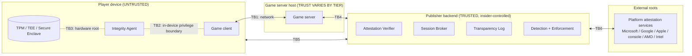

# 01 — Threat Model

Status: Draft v1 · Scope: all titles, all platforms, worldwide operation
Method: adversary-centric (who, what they want, what they can do) → threat catalog
(what they do) → control locus (where it can be stopped). Every requirement in
[02-requirements.md](02-requirements.md) traces back to a threat ID here.

---

## 1. What we are protecting (assets)

| ID | Asset | Why it matters | Harm if lost |
|----|-------|----------------|--------------|
| AS1 | **Competitive integrity**: match outcomes, ranks, leaderboards, tournament results | The product *is* fair competition | Churn; esports and prize-money liability |
| AS2 | **Economy**: currencies, items, marketplace, progression | Real money flows through it (purchases, RMT black markets) | Inflation, dupes, fraud, refunds, regulatory exposure |
| AS3 | **Player accounts and PII** | Identity, payment, social graph | Account takeover (ATO), privacy breach, fines |
| AS4 | **Player devices** | The anti-cheat runs on millions of machines, often privileged | AC becomes malware vector or crashes fleets |
| AS5 | **Enforcement integrity**: bans must be correct and defensible | False bans destroy trust; wrong bans are legal risk | Mass false positives, appeals flood, lawsuits |
| AS6 | **Detection secrecy and velocity** | Cheat vendors iterate against what they can observe | Detection vectors burned within hours |
| AS7 | **Infrastructure**: game servers, backend, build pipeline | Everything above depends on it | Outage, supply-chain compromise |
| AS8 | **Evidence**: telemetry, replays, transcripts | Needed for detection, appeals, disputes, audits | Undefendable bans, repudiation |

## 2. Adversaries

Cheating is a **business**. Cheat-as-a-service vendors sell subscriptions, HWID
spoofers, "undetected" guarantees and account shops. Design against the
*economics* of that business, not just against individual techniques.

| ID | Adversary | Motive | Capability | Scale |
|----|-----------|--------|-----------|-------|
| A1 | **Casual cheater** | Win, rank, status | Buys and runs off-the-shelf cheats; low skill | Very high |
| A2 | **Cheat developer / vendor** | Subscription revenue | Reverse-engineers game and AC; writes kernel, hypervisor and firmware code; tests against live detection; operates spoofers | Low count, very high leverage (one vendor = thousands of cheaters) |
| A3 | **Hardware cheater** | Evade software AC entirely | DMA (PCIe FPGA) cards, second PC, capture card with CV/ML aimbot, KMBox/Arduino HID injection, Cronus Zen/XIM on console | Growing fast; price per setup falling |
| A4 | **Bot farmer / RMT operator** | Real-money trading, gold and item farming | Headless protocol clients, VM farms, account farms, residential proxies | High in MMOs and F2P economies |
| A5 | **Rogue or compromised server host** | Favoritism, item minting, data harvest, framing players | Full control of a GS binary/host (community, partner, edge, or compromised first-party host) | Low count, high impact |
| A6 | **Network attacker** | Advantage or disruption | DDoS, lag switching, packet shaping, local MITM proxies, IP harvesting | Medium |
| A7 | **Insider** | Money, grudge, coercion | Access to ban tools, item grants, detection logic, build and signing pipeline | Low count, very high impact |
| A8 | **Account attacker** | Resale, boosting, ban evasion | Credential stuffing, phishing, SIM swap, account markets, smurfing | High |
| A9 | **Colluder / griefer** | Rank manipulation, harassment | Win-trading, teaming, ghosting/stream-sniping, out-of-band comms | Medium |
| A10 | **Attacker targeting the AC itself** | Malware distribution, surveillance, sabotage | Exploits in privileged AC components (BYOVD), content/update-channel compromise, abuse of collected data | Low count, catastrophic impact |

Two precedents make A10 non-hypothetical:
- A signed anti-cheat kernel driver (`mhyprot2.sys`) was abused by ransomware
  operators in 2022 to kill antivirus processes: a legitimately signed AC driver
  became a malware primitive.
- In July 2024 a faulty content update to a kernel-resident security product
  crashed roughly 8.5M Windows machines. Anti-cheat has the same architecture
  (privileged component plus frequently pushed content). Microsoft's Windows
  Resiliency Initiative and its May 2026 Driver Quality Initiative push
  third-party kernel code toward user mode as a result.

## 3. Trust boundaries

- **TB1 client↔GS**: everything the client sends is adversarial. Everything the
  GS sends to the client is readable by the cheater, even if encrypted, because
  the cheater owns the endpoint.
- **TB2 game↔Integrity Agent**: same privilege level on most platforms. A cheat
  running at higher privilege (kernel, hypervisor, DMA, firmware) can lie to
  software AC. This is why hardware-rooted attestation matters.
- **TB3 hardware root**: TPM 2.0 / Pluton, Android StrongBox/TEE, Apple Secure
  Enclave, console security processors, AMD SEV-SNP / Intel TDX. This is the only
  boundary a software-only attacker cannot cross cheaply.
- **TB4 GS↔backend**: trust depends on who operates the GS (see server trust
  tiers in [03-architecture.md](03-architecture.md)).
- **TB5**: the device talks to the backend for attestation, admission and telemetry.
- **TB6**: our appraisal depends on platform vendors' endorsements and
  revocation data.

## 4. Threat catalog

Legend. **Locus** = where it can be *controlled*:
`P` prevent by server authority or information minimization · `A` hardware or
platform attestation · `C` client-side detection (Integrity Agent) · `S`
server-side or behavioral detection · `E` economics or enforcement (deterrence)
· `X` protocol cryptography. **Sev** = expected harm × prevalence (H/M/L).

### 4.1 Client state and code manipulation

| ID | Threat | Adversary | Sev | Locus | Notes |
|----|--------|-----------|-----|-------|-------|
| T01 | **Memory write**: god mode, infinite ammo, no-recoil, teleport, resource edits | A1, A2 | H→L | **P**, C | Fully neutralized by server authority. Only matters for state the client is wrongly allowed to own. |
| T02 | **Memory read: ESP, wallhack, radar** | A1, A2 | **H** | **P** (information minimization), S, A, C | The dominant cheat class in competitive games. Encryption does not help: the client must decrypt to render. You can only reduce what is sent, then detect *use* of hidden information. |
| T03 | **Aimbot / triggerbot** (memory read + synthetic input) | A1, A2 | **H** | S, A, C | Server sees only "a very good player". Behavioral detection over aim kinematics is the backbone. |
| T04 | **Code injection, hooking, modified binaries or assets** (DLL injection, shader or texture swaps, removing foliage) | A1, A2 | H | A, C, X | Build measurement plus runtime integrity. Asset-level cheats need asset hashes in the build manifest. |
| T05 | **Speedhack / time manipulation** | A1 | M→L | **P**, X | Solved at protocol level: the server tick is the only clock, and input rate is bounded per tick. |
| T06 | **Kernel-mode cheats** (manually mapped drivers, BYOVD with vulnerable signed drivers) | A2 | H | **A** (HVCI, driver attestation, vulnerable-driver blocklist), C | Windows runtime attestation now reports loaded drivers (see T13). |
| T07 | **Hypervisor / VM-based cheats** (EPT hooks, hiding from the OS) | A2 | M | A (measured boot, VBS), C | Measured boot plus VBS makes an attacker-controlled hypervisor visible in PCRs, or incompatible with the required configuration. |
| T08 | **DMA cheats**, including pre-boot DMA | A3 | **H** | **A** (IOMMU, Kernel DMA Protection, firmware version policy), S | Real 2025 case: several vendors' UEFI builds reported pre-boot DMA protection while IOMMU was not initialized (CVE-2025-11901, CVE-2025-14302/14303/14304). Firmware version is now part of appraisal. |
| T09 | **Boot / firmware cheats** (bootkits, UEFI modules, Secure Boot bypass) | A2 | M | **A** (measured boot, Secure Boot policy, dbx currency) | Appraise the TCG event log, not just "Secure Boot = on". |
| T10 | **External computer-vision aimbots** (screen or capture-card → YOLO-class model → input device) | A3 | **H, rising** | **S**, E | The *analog hole*: no memory access, so AC on the gaming device sees nothing. Only behavioral detection, input-device telemetry, and account economics apply. Hits consoles and cloud gaming too. |
| T11 | **Input device spoofing / emulation** (KMBox, Arduino HID, Cronus Zen, XIM, macro software) | A3, A1 | H | S, C (HID telemetry), E | USB descriptors are spoofable. Treat them as a weak signal combined with kinematics. |
| T12 | **Headless clients / protocol bots** | A4 | H (MMO) | A, X, S | Attested device plus build identity makes protocol reimplementation expensive. Behavioral farm detection covers the rest. |
| T13 | **AC tampering**: disabling, emulating responses, replaying attestation, spoofing HWID | A2 | **H** | **A**, X | Nonce-bound, hardware-signed evidence appraised by the server. A software-only "AC says OK" message is worthless. |
| T14 | **Emulated attestation** (software TPM such as swtpm, emulators pretending to be phones) | A2, A4 | M | A (endorsement chain to a hardware vendor root) | Requires EK certificate chain validation and platform-backed verdicts. |

### 4.2 Network and protocol

| ID | Threat | Adversary | Sev | Locus | Notes |
|----|--------|-----------|-----|-------|-------|
| T15 | **Packet tampering, injection, replay** | A1, A6 | M | **X** | QUIC/TLS 1.3 AEAD plus sequence numbers. Trivially solved when TLS is verified. |
| T16 | **Lag switching / selective delay** to exploit lag compensation or desync | A1, A6 | M | **P** (bounded rewind, input-age limits), S | Cap how far back the server rewinds; penalize the laggy party rather than the victim. |
| T17 | **DDoS against game servers or players** (IP leaked via P2P or voice) | A6 | H | infra | Relay-only topology, no peer IP exposure, anycast scrubbing. |
| T18 | **MITM / fake server / local proxy cheats** | A6, A1 | M | **X** (verified TLS, pinning), A | Proxy cheats are common on mobile. Requires real certificate verification and device-bound session keys. |
| T19 | **Token theft / session hijack / relay** | A8, A6 | M | **X** (proof-of-possession, channel binding) | Bearer tokens must not exist in the session plane. |

### 4.3 Server and host

| ID | Threat | Adversary | Sev | Locus | Notes |
|----|--------|-----------|-----|-------|-------|
| T20 | **Rogue GS**: favoritism, fabricated outcomes, item minting, forged inputs, *framing players with fake evidence* | A5 | H for non-first-party hosts | A (confidential VM), **X** (signed checkpoints, client-signed input commits), S (replay audit) | This is the repo's original focus. It is essential for community, partner and edge hosting, and it protects the *evidence* used against players. |
| T21 | **Compromised GS binary or build pipeline** | A7, A2 | H | A (measured launch), SLSA provenance, transparency | Reference values come from a signed, transparency-logged build registry. |
| T22 | **Split view**: GS shows different histories to clients, auditors and the log | A5 | M | **X** (checkpoint gossip, equivocation proofs) | Borrowed from Certificate Transparency gossip. |
| T23 | **Server logic exploits** (race-condition dupes, disconnect dupes) | A1, A4 | H | P (transactional economy), S | "Exploit", not "cheat", but handled by the same pipeline. |

### 4.4 Economy and accounts

| ID | Threat | Adversary | Sev | Locus | Notes |
|----|--------|-----------|-----|-------|-------|
| T24 | **Duplication** via replay, race, or failed idempotency | A1, A4 | H | **P** (idempotency keys, double-entry ledger), X | |
| T25 | **Botting, gold farming, RMT** | A4 | H (MMO) | S (graph analytics, periodicity), A, E | |
| T26 | **Account takeover, account trading, smurfing, boosting** | A8 | H | identity (MFA, passkeys), S, E | |
| T27 | **Ban evasion**: new accounts, HWID spoofing, VPN | A1, A2 | **H** | **A** (hardware-rooted device identity), E | Bans only work when they are expensive to evade. |
| T28 | **Collusion**: win-trading, teaming, ghosting | A9 | M | S (graph plus information-use analysis), P (broadcast delay) | Out-of-band comms cannot be prevented, only detected statistically. |
| T29 | *Payment fraud / chargebacks* | A8 | — | out of scope | Owned by payments. Consumed here only as an account-risk signal. |

### 4.5 The anti-cheat system as a target

| ID | Threat | Adversary | Sev | Locus | Notes |
|----|--------|-----------|-----|-------|-------|
| T30 | **Supply-chain attack on AC updates or detection content** | A10, A7 | **Catastrophic** | signing, transparency log, staged rollout, sandboxed content | |
| T31 | **Vulnerability in a privileged AC component** used for privilege escalation (BYOVD) | A10 | **Catastrophic** | memory-safe implementation, minimal kernel surface, on-demand loading | |
| T32 | **Privacy harm, over-collection, legal non-compliance** (GDPR, CCPA/CPRA, LGPD, PIPL, PIPA, minors' codes) | company risk | H | data minimization, regionalization, DPIAs | Regulators treat kernel-level collection skeptically. |
| T33 | **False positives / mass false bans** (accessibility tools, overlays, hardware quirks, high-latency regions) | internal | **H** | multi-signal policy, human review, shadow mode, FP budgets | |
| T34 | **Insider abuse**: unauthorized ban/unban, item grants, leaking detections | A7 | H | two-person rule, audit log in the transparency log, least privilege | |
| T35 | **Detection feedback loop**: vendors test cheats and read ban timing | A2 | H | delayed and batched enforcement, server-side models, rotating client content | |
| T36 | **Evidence tampering or repudiation** (by players, rogue hosts, insiders) | A5, A7 | M | signed input commits, Merkle checkpoints, transparency log | |
| T37 | **DoS on AC backend to force fail-open** | A6, A2 | M | cached short-lived results, per-queue fail-mode policy, regional isolation | |

## 5. Platform residual-risk matrix

What each platform's *best available* root of trust leaves uncovered. This drives
per-platform tiers and matchmaking pools.

| Platform | Best root of trust (2026) | Covers | Residual threats |
|----------|---------------------------|--------|------------------|
| Windows 11 (25H2+) with TPM 2.0, Secure Boot, VBS/HVCI, IOMMU | TPM quote + measured-boot log; `GetRuntimeAttestationReport` (signed by Secure Kernel, driver + code-integrity reports, nonce-bound, requires TPM 2.0, Secure Boot, VBS, HVCI, IOMMU, no test-signing) | T06–T09, T13, T14 largely; T08 with firmware policy | T02/T03 via same-privilege tricks inside allowed config, T10, T11 |
| Windows 10 or weak config | TPM (if present), no runtime report | partial | T06–T09 open → lower tier |
| macOS | App Attest (where supported), SIP, notarization | T04, T12 partial | T02/T03 via debugging entitlements if SIP is off, T10, T11 |
| Linux / Steam Deck | Usually none usable (Secure Boot typically off) | — | Most client threats → server-side only, separate pools |
| Android | Play Integrity (hardware-backed verdicts since May 2025; `MEETS_STRONG_INTEGRITY` needs a security patch within 12 months on Android 13+) + Android Key Attestation | T04, T12, T14 largely | Rooted devices hiding root, T18 proxies, T10 (screen capture), emulator keymappers |
| iOS / iPadOS | App Attest + DeviceCheck | T04, T12, T14 | Jailbreak edge cases, T10 |
| Consoles | Platform security processor + platform auth (NDA SDKs) | T01–T09, T12–T14 | **T10, T11 (Cronus/XIM)**, T16, T28 |
| Cloud gaming | Game runs in provider's datacenter | T01–T09 | **T10, T11**, T28 |

**Key insight:** there is *no* platform where client-side controls cover T10/T11.
Server-side behavioral detection is the only control that spans every platform,
including consoles and cloud. It is mandatory, not a nice-to-have.

## 6. Strategic conclusions (these drive the requirements)

1. **Authority beats detection.** Anything the server owns cannot be cheated
   (T01, T05, T23, T24). Make the server authoritative for all state and the
   client a sender of *intent* only.
2. **Information minimization is the main anti-ESP control.** An encrypted
   packet still arrives decrypted in client memory. The only prevention is to
   never send what the player cannot legitimately perceive (T02, T28).
3. **Hardware-rooted attestation replaces "trust the AC process".** Cheats that
   out-privilege the AC (T06–T09, T13, T14) are addressed by the platform
   attesting its own configuration. As of 2026 Windows exposes this to user mode
   (`GetRuntimeAttestationReport`), and industry practice already requires it
   (TPM 2.0 + Secure Boot for Call of Duty BO7 and Battlefield 6; Riot Vanguard
   with Secure Boot, TPM 2.0, VBS/HVCI and IOMMU plus runtime attestation on
   25H2). **Our design must be attestation-first, with any kernel component
   optional, minimal and on-demand.**
4. **Behavioral detection is the universal layer.** It is the only answer to
   T10/T11, the only one that works on consoles and cloud, and it is invisible
   to cheat developers (T35).
5. **Make identity expensive.** Durable, hardware-rooted device identity plus
   account signals turn bans into a real cost (T27, T25). Cheating economics
   collapse when every ban burns hardware or a costly account.
6. **The AC system is itself high-value attack surface** (T30, T31, T32).
   Memory-safe implementation, signed and transparency-logged content, sandboxed
   detection modules, staged rollouts and privacy-by-design are security
   requirements, not polish.
7. **Rogue-host defenses are a tier, not a universal tax.** First-party servers
   are protected by infrastructure security. Partner, community and edge hosts
   need confidential computing plus verifiable transcripts (T20–T22). The
   transcript machinery also protects *evidence* against players (T36), so it is
   worth running everywhere at low cost.
8. **Enforcement must be correct before it is fast.** Multi-signal confidence,
   human review for non-obvious cases, and delayed waves where they protect
   detection vectors (T33, T35).

## 7. Explicit non-goals and limits

- We cannot prevent all cheating. The analog hole (T10) is only
  *statistically* detectable.
- Attestation proves *configuration*, not the absence of every cheat within an
  allowed configuration.
- We do not claim to stop out-of-band collusion (voice chat, second screens),
  only to detect its statistical footprint.
- We do not rely on security-by-obscurity for correctness. Obfuscation and
  rotating detection content only raise cost. The protocol must be secure with
  its specification public.
