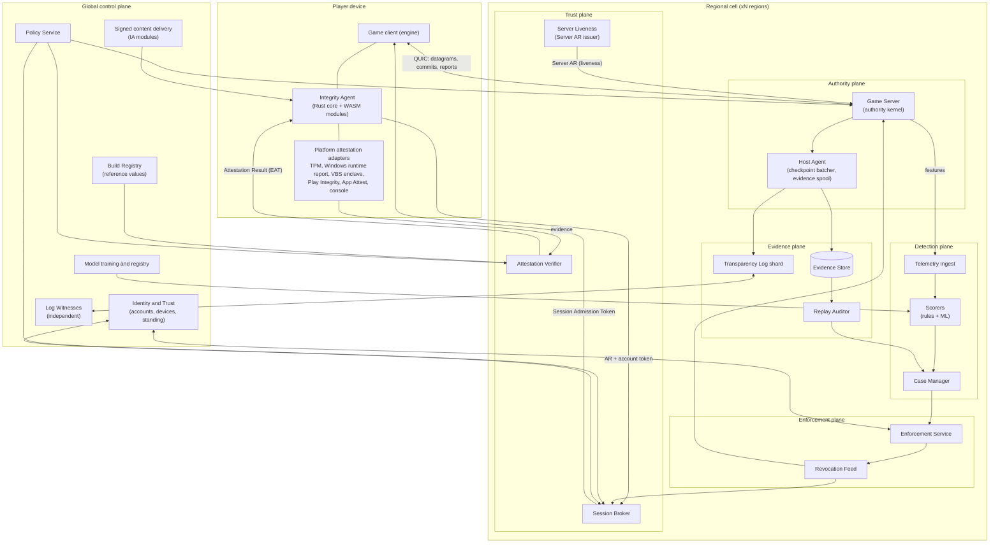
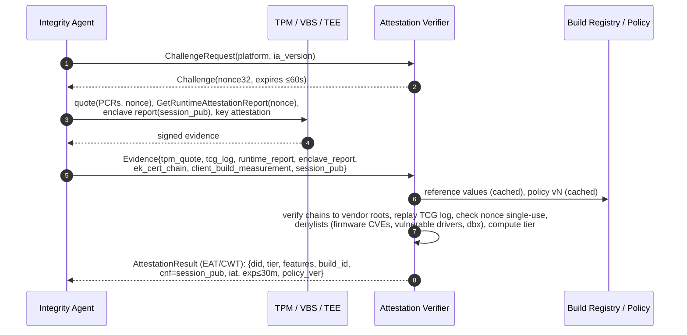
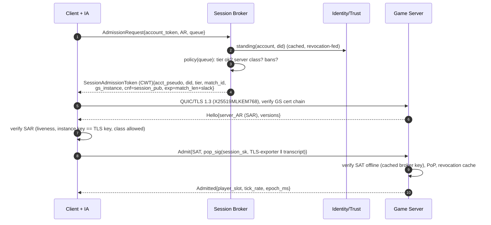
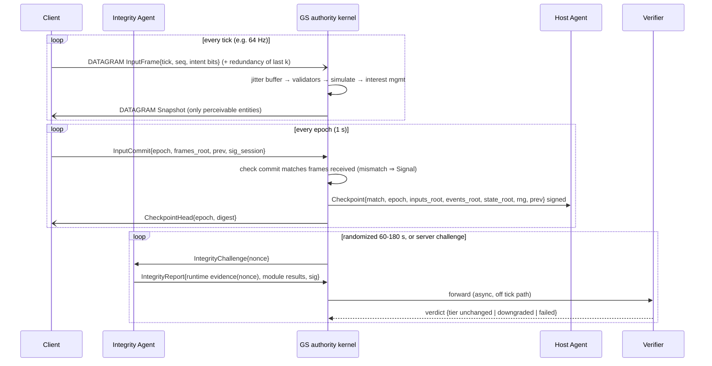
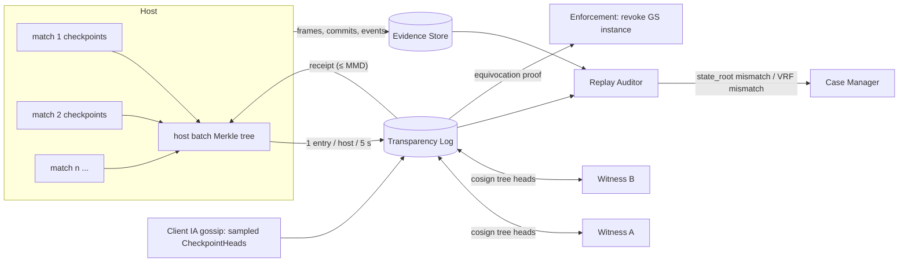
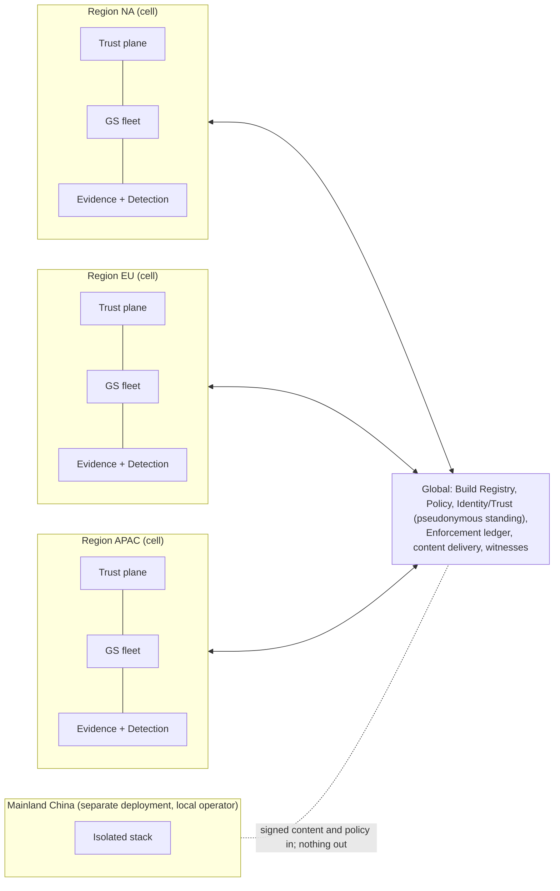

# 03 — System Architecture

Status: Draft v1. Derived from [01-threat-model.md](01-threat-model.md) §6 and
[02-requirements.md](02-requirements.md). Wire-level details are in
[04-protocol.md](04-protocol.md). Domain terms are in [05-ontology.md](05-ontology.md).

---

## 1. Design principles

Each principle is a direct consequence of the threat analysis.

| # | Principle | Because |
|---|-----------|---------|
| P1 | **Don't trust, don't send.** Server authority for state and information minimization for perception. | T01, T02, T05, T24 |
| P2 | **Attest the platform, don't trust the agent.** Hardware- or OS-rooted evidence, appraised server-side, consumed as short-lived signed results. | T06–T09, T13, T14 |
| P3 | **Detect behavior everywhere.** Server-side behavioral detection is the one layer that covers all platforms and all cheat classes, including the analog hole. | T03, T10, T11, T35 |
| P4 | **Make every claim verifiable later.** Signed input commits, Merkle checkpoints and a witnessed transparency log. Evidence must survive a hostile host, a hostile player and a hostile insider. | T20, T22, T34, T36 |
| P5 | **Nothing external in the tick path.** All credentials verify offline with cached keys. Revocation is pushed, and bounded by short TTLs. | T37, OPS-02 |
| P6 | **Tiers, not walls.** Device and server trust tiers feed matchmaking and policy. Weaker platforms get segregated pools, not silent trust. | T33, PLAT-02 |
| P7 | **The anti-cheat must not become the vulnerability.** Memory-safe code, minimal privilege, sandboxed and staged content, privacy by design. | T30, T31, T32 |
| P8 | **Regional cells, global policy.** Each region runs independently; policy, builds and enforcement state replicate globally within data-residency limits. | T37, T32 |

## 2. System overview

Six planes. A *plane* is a set of components with the same latency, trust and
scaling profile. The prototype's single "VS" conflated all six (see
[05-ontology.md](05-ontology.md) §2).



## 3. Component catalog

| Component | Plane | Responsibility | Trust | Scale unit | State |
|-----------|-------|----------------|-------|-----------|-------|
| **Integrity Agent (IA)** | Device | Evidence collection, session key custody, integrity reports, sandboxed detection modules, checkpoint gossip | Untrusted host; its keys are hardware-protected | per device | local only |
| **Platform adapters** | Device | Thin native glue to TPM/TBS, `GetRuntimeAttestationReport`, VBS enclave, Play Integrity + Key Attestation, App Attest, console SDKs | platform-rooted | per platform | none |
| **Attestation Verifier** | Trust | RATS Verifier: nonces, evidence appraisal against reference values, endorsements and policy; issues Attestation Results (EAT/CWT) | high | stateless + nonce cache | nonce cache (TTL 60 s) |
| **Session Broker** | Trust | Admission: account standing + AR + queue policy → Session Admission Token (SAT). Co-located with matchmaking. | high | stateless | none (reads Identity/Trust) |
| **Server Liveness** | Trust | Issues short-lived Server Attestation Results (SAR) to GS instances; stops renewing on revocation. Successor to the prototype's PlayTicket loop. | high | stateless | instance registry |
| **Game Server (GS)** | Authority | Authoritative simulation, input validation, interest management, bounded lag compensation, feature extraction, per-epoch checkpoints | per server tier | per match | in-memory |
| **Host Agent** | Authority | Batches checkpoints of all matches on a host into one log entry, spools evidence, relays integrity reports | same as GS host | per host | bounded disk spool |
| **Transparency Log** | Evidence | Append-only Merkle log (RFC 9162 style), inclusion and consistency proofs, receipts with MMD | high, publicly verifiable | sharded per region | tiles in object storage |
| **Witnesses** | Evidence | Independently co-sign log tree heads (at least one outside the publisher's control) | independent | global | last-seen heads |
| **Evidence Store** | Evidence | Content-addressed, encrypted epoch data (frames, commits, events) | high | regional object store | retention per class |
| **Replay Auditor** | Evidence | Deterministic re-simulation, `state_root` comparison, VRF recomputation | high | batch workers | none |
| **Telemetry Ingest** | Detection | Regional stream bus for features and signals | high | partitions | stream retention |
| **Scorers** | Detection | Rules + ML inference (server-side only) → Signals / Detections | high, secret | workers | model cache |
| **Case Manager** | Detection | Aggregates Signals per subject, applies verdict policy, human review queue, appeals | high, access-controlled | service + UI | cases |
| **Enforcement Service** | Enforcement | Executes Actions, writes enforcement ledger, publishes revocations, economy rollbacks | high, two-person rule | service | enforcement ledger |
| **Revocation Feed** | Enforcement | Pub/sub of revocation events to brokers and GS (≤ 5 s p99) | high | regional topics | compacted log |
| **Build Registry** | Global | Signed build manifests (client, GS, IA, modules), SLSA provenance, reference measurements | root of reference values | global | append-only |
| **Policy Service** | Global | Versioned, signed policies: tier requirements per queue, appraisal rules, fail modes, action thresholds | high | global | versioned |
| **Identity and Trust** | Global | Accounts, device pseudonyms (DID), bindings, standing, trust score | high, PII | global, residency-aware | DB |
| **Economy Ledger** | Global/regional | Double-entry transactional ledger with idempotency keys and provenance | high | sharded | DB |
| **Content delivery** | Global | Signed, staged IA module distribution with rollback | high | CDN | versions |

## 4. Trust tiers

### 4.1 Device Trust Tier (in every Attestation Result)

| Tier | Meaning | Typical evidence | Covers |
|------|---------|------------------|--------|
| **D0** Unknown | No usable attestation | none, or failed appraisal | nothing client-side |
| **D1** Software | IA integrity only, no hardware root | IA self-measurement, OS signals | casual deterrence |
| **D2** Hardware platform | Hardware-rooted device + app identity | TPM 2.0 EK chain + measured boot + Secure Boot (PC); Play Integrity `MEETS_STRONG_INTEGRITY` + Key Attestation (Android); App Attest (Apple) | T04, T12, T13, T14, most T09 |
| **D3** Hardened | D2 plus a hypervisor-enforced kernel and DMA protection, runtime-attested | Windows 11 25H2+: VBS + HVCI + IOMMU + `GetRuntimeAttestationReport` clean + firmware not denylisted. Consoles and cloud gaming count as D3-equivalent for memory-cheat classes. | + T06, T07, T08 |

The tier is a claim computed by the Verifier from policy. Relying parties never
recompute it.

### 4.2 Server Trust Class

| Class | Who operates the GS | Required | Allowed |
|-------|---------------------|----------|---------|
| **S-Community** | Players / modders | nothing (unattested) | Unranked only; no economy writes; results not counted |
| **S-Partner** | Third-party host, regional publishing partner, edge or MEC | Confidential VM (SEV-SNP/TDX) attested; SAR liveness; 100% replay audit of progression-affecting matches | Ranked; economy writes via Economy Ledger |
| **S-FirstParty** | Our infrastructure | Measured image + SAR liveness | Everything |
| **S-FirstParty-CVM** | Our infrastructure in confidential VMs | + CVM attestation (defends against cloud operator and insiders) | Everything; tournaments |

### 4.3 Queue policy (example)

```yaml
# policy/v42/queues/ranked-5v5.yaml  (signed by Policy Service)
queue: ranked-5v5
min_device_tier: { windows: D3, macos: D2, android: D2, ios: D2, console: D3, linux: D0 }
below_tier: segregate          # segregate | reject
server_classes: [S-FirstParty, S-FirstParty-CVM]
ar_max_age_s: 1800
reattest_interval_s: [60, 180]
fail_mode: fail_closed          # Verifier unavailable and cached AR expired -> hold in queue
kernel_component: optional      # title may require it only for D3 on Windows
checkpoint_epoch_ms: 1000
audit_sample_rate: 0.05
```

## 5. Key flows

### 5.1 Device attestation (passport model, RFC 9334 §5.1)



The Verifier is the **only** component that understands TPM, Android, Apple,
AMD and Intel evidence formats. Everything downstream sees one Ed25519-signed
CWT. This isolates the complex, frequently changing parsing code in one
fuzzed, memory-safe service.

### 5.2 Admission and connection



No bearer token exists on the session plane: a stolen SAT is useless without
`session_sk`, which lives in the TPM, VBS enclave or TEE, and a relayed SAT
fails the TLS-exporter binding.

### 5.3 In-match loop



### 5.4 Evidence and accountability



What this buys:
- **A rogue host cannot rewrite history.** Checkpoints are signed and logged,
  and witnesses prevent the log itself from forking.
- **A rogue host cannot forge inputs.** `inputs_root` must match
  client-signed InputCommits.
- **A rogue host cannot fake outcomes or grind randomness.** The Auditor
  re-simulates and recomputes the VRF.
- **A rogue host cannot show different histories to different clients.**
  Client gossip plus signed heads yield equivocation proofs.
- **Players cannot repudiate their inputs, and insiders cannot fabricate
  evidence.** Enforcement evidence is anchored in the log.

### 5.5 Server liveness (evolution of the prototype's PlayTicket)

The prototype's best idea, authorization by liveness where "no fresh ticket
means you are cut off", is kept and moved to where it belongs:

1. A GS instance boots in a measured image (or CVM). The instance key is
   generated inside and bound into the attestation report (`report_data =
   H(instance_pub)`).
2. Server Liveness appraises the evidence (through the Verifier) and issues a
   **SAR** with TTL 60–120 s, renewed continuously over the GS↔cell control
   channel.
3. The GS staples the current SAR to clients over the session control stream.
   Clients require an unexpired SAR whose key matches the TLS certificate key.
4. Revocation means Server Liveness stops renewing. Within one TTL every client
   disconnects, even if the rogue host ignores the revocation feed.

### 5.6 Detection → enforcement

```mermaid
flowchart LR
  subgraph Sources
    V1[GS validators]
    V2[Information-use features]
    V3[Aim/input kinematics]
    V4[IA module results]
    V5[Economy graph]
    V6[Player reports]
    V7[Honeypot hits]
    V8[Replay audit]
  end
  Sources --> SIG[Signals] --> SC[Scorers: rules + models] --> DETN[Detections<br/>confidence, family]
  DETN --> CASE[Case per subject<br/>time-decayed accumulation]
  CASE --> POLV{Verdict policy<br/>ENF-02}
  POLV -- "≥2 independent families<br/>or crypto proof" --> AUTO[Automated verdict]
  POLV -- otherwise --> HR[Human review]
  HR --> VERD[Verdict]
  AUTO --> VERD
  VERD --> ACT[Action scheduler<br/>immediate or wave]
  ACT --> ENFS[Enforcement Service] --> REVF[Revocation Feed] --> GSx[GS kick / Broker deny]
  ENFS --> LEDG[(Enforcement ledger → Transparency Log)]
  VERD -. labels .-> TRAIN[Model training]
```



## 6. Integrity Agent (client) architecture

```text
┌───────────────────────────────────────────────────────────────────────┐
│ L4  Optional privileged component (per-title policy, Windows only)     │
│     on-demand driver: handle-access stripping for game process,       │
│     image-load notifications; no network, no complex parsing, narrow  │
│     IOCTL; unloaded after session                                     │
├───────────────────────────────────────────────────────────────────────┤
│ L3  Detection modules: WebAssembly, signed, versioned, rotating,      │
│     capability-restricted host API (read game-process memory ranges,  │
│     enumerate modules, timing); fuel/memory limits; staged rollout    │
├───────────────────────────────────────────────────────────────────────┤
│ L2  IA core (Rust, user mode): protocol client, evidence packaging,   │
│     session-key operations, IntegrityReports, module host (wasmtime), │
│     checkpoint gossip, telemetry summarizer, policy client, C ABI     │
├───────────────────────────────────────────────────────────────────────┤
│ L1  Platform adapters (thin, native language of the platform)         │
│     Windows: TBS/TPM2, TCG log, GetRuntimeAttestationReport,          │
│              VBS enclave (session key + enclave attestation)          │
│     Android: Play Integrity (Kotlin), Keystore key attestation        │
│     Apple:   App Attest (Swift), Secure Enclave keys                  │
│     Console: platform SDK auth/attestation (C/C++ under NDA)          │
├───────────────────────────────────────────────────────────────────────┤
│ L0  Hardware / OS roots: TPM 2.0 / Pluton, Secure Kernel (VTL1),      │
│     TEE / StrongBox, Secure Enclave, console security processor       │
└───────────────────────────────────────────────────────────────────────┘
```

Design notes:
- **Why WASM for detection content.** The 2024 kernel-content outage and T30
  show that the content channel is the riskiest part of any endpoint security
  product. A sandboxed module can fail (trap, fuel exhaustion) without taking
  down the game or the OS. Modules update daily without native code pushes, and
  rotating module logic raises the cheat vendor's reverse-engineering cost
  (T35).
- **Why the kernel component is optional.** On D3 Windows the OS itself attests
  kernel integrity (HVCI, loaded-driver report, IOMMU). A kernel driver adds
  handle protection and faster reaction, but it is a liability (T31, T32) and is
  under platform pressure (Windows Resiliency Initiative, May 2026 Driver
  Quality Initiative). Titles opt in only if their threat profile requires it.
- **Session key custody.** On Windows the session key lives in a VBS enclave
  (VTL1), which even a kernel-level cheat in VTL0 cannot read. The enclave's
  attestation report binds `session_pub`. Elsewhere it lives in TEE/StrongBox
  or the Secure Enclave. This makes IntegrityReports and InputCommits
  unforgeable by other processes. It does **not** prove inputs are
  human-generated; that is behavioral detection's job.

## 7. Game Server authority kernel

```text
QUIC endpoint (quinn) ──► Session gate (SAT + PoP verify, revocation cache)
      │
      ▼
Datagram decode ─► per-player jitter buffer (≤ N ticks) ─► Validators (title rules)
      │                                                        │ Signals
      ▼                                                        ▼
Deterministic simulation (fixed tick) ◄── bounded lag comp ── Feature extractor
      │                                                        │ (aim windows, info-use)
      ├─► Interest manager (PVS + audibility + margin) ─► per-client snapshot
      └─► Epoch accumulators: inputs Merkle, events Merkle, state_root, VRF log
                 │
                 ▼
        Checkpoint signer (instance key) ─► Host Agent ─► Log / Evidence Store
```

- **Validators** are title code behind a stable trait (`AuthorityRules`). The
  framework supplies the pipeline, Signal emission and metrics.
- **Determinism contract** (AUTH-06): the simulation that feeds `state_root`
  uses ordered collections, fixed-point or controlled floats, and seeded RNG
  via VRF. Titles whose full simulation cannot be deterministic declare an
  *audit projection*: a deterministic subset (movement, hits, economy events)
  that is replayed.
- **Interest management** is both a performance feature and the primary
  anti-ESP control. Visibility checks run with a latency margin to avoid
  pop-in, which is a known competitive trade-off.

## 8. Detection and ML pipeline

| Stage | Tech (proposal) | Notes |
|-------|-----------------|-------|
| Feature extraction | GS (Rust), per engagement window | Aim deltas at input resolution, time-to-target, flick profiles, tracking error vs. target motion, reaction to occluded or honeypot entities, input timing entropy |
| Ingest | Kafka-compatible bus, regional | Pseudonymous IDs only (PRIV-03) |
| Online scoring | Rust services; ONNX models via ONNX Runtime or a pure-Rust runtime | Rules first, ML second; all server-side (GOV-03) |
| Case aggregation | Rust service + relational store | Time-decayed evidence per subject; signal-family independence tracking |
| Offline training | Python / PyTorch, region-local data lakes | Labels from reviewer verdicts and confirmed cheats. Sequence models (temporal conv / transformer) over aim windows, graph models for economy and collusion. |
| Model governance | Registry + evaluation reports | Shadow → canary → enforce. Precision at the operating point sliced by region, platform, input device and latency bucket (DET-04). Adversarial evaluation against known CV-aimbot smoothing. |

## 9. Global deployment



- **Residency.** Raw telemetry and evidence never leave the region. Account
  standing and device pseudonyms replicate globally so bans hold across regions.
  Model training is region-local, or uses aggregated features.
- **Mainland China.** The usual industry pattern is a separately operated stack
  run by a licensed local operator, with no data export. It consumes signed
  policy, content and builds. This needs legal review per title.

## 10. Failure modes and degradation

| Failure | Blast radius | Behavior |
|---------|--------------|----------|
| Verifier unavailable (region) | New ARs only | Cached ARs valid until `exp`. `fail_closed` queues hold players without a valid AR. `fail_open_degraded` queues admit at D0 into segregated pools. Page on-call. |
| Broker unavailable | Admissions in region | Matchmaking pauses (same availability domain). Running matches unaffected. |
| Server Liveness unavailable | SAR renewals | GS keeps serving until SAR `exp` (60–120 s), then clients disconnect gracefully. SAR TTL is a deliberate trade-off between revocation speed and outage tolerance. |
| Log unavailable | Evidence finality | Host Agent buffers ≥ 2 × MMD. Beyond that, matches are marked *unlogged*: ranked results provisional, no automated enforcement from them. |
| Evidence Store unavailable | Audits and cases | Spool on host (bounded). Lost samples reduce audit coverage; no fabricated gaps. |
| Revocation feed delayed | Enforcement latency | Bounded by SAT (match length) and AR (≤ 30 min) TTLs. |
| Bad IA content push | Client stability | Ring gating, auto-rollback on crash/perf SLO breach, per-module kill switch. WASM traps are contained. |
| Platform vendor endpoint down (e.g. revocation list fetch) | Some evidence classes | Use cached endorsements within freshness policy, then downgrade tier. Never a global lockout. |
| Equivocation detected | One GS instance | Automatic instance revocation. Matches since last consistent checkpoint invalidated and re-audited. |

## 11. Capacity model (design point: 10 M CCU)

Order-of-magnitude figures, to be recalibrated with title telemetry.

| Quantity | Derivation | Value |
|----------|-----------|-------|
| Session admissions | 10 M CCU / 20 min avg session | ≈ 8.3 k/s avg, 10 k/s design peak |
| Runtime re-attestations | 10 M / 120 s | ≈ 83 k appraisals/s global. At ~0.2 ms CPU each (signature + policy) that is about 17 cores plus headroom, spread over regions. |
| InputCommit verifications on GS | 1/player/s | ≈ 10 M Ed25519 verifies/s global; ~2 k/s per 2 k-player host ≈ 0.1 core/host (less with batch verification) |
| Checkpoints signed | ~500 k matches × 1/s | cheap (Ed25519 sign ≈ tens of µs) |
| Log appends | 5 k hosts × 1 entry / 5 s | ≈ 1 k entries/s global. Two-level batching (match → host → log) keeps the log small. |
| Raw input evidence | ~64 Hz × ~16 B ≈ 1 KB/s/player raw, ~0.25 KB/s compressed | ≈ 2.5 GB/s global ≈ 200 TB/day. Keep 72 h hot; retain long-term only for cases, audits and samples. |
| Features to ingest | ~100 B/s/player summarized | ≈ 1 GB/s global |

## 12. Mapping from the current prototype

| Prototype element | Keep / change | Target |
|-------------------|---------------|--------|
| VS ticket loop + GS ticket starvation | **Keep the idea**, move it | Server Liveness issuing SARs (§5.5) |
| Ephemeral session key signed by long-term key | **Keep** | GS instance key bound into CVM/measured-boot evidence |
| Signed client inputs | **Keep, restructure** | Unsigned datagram frames plus signed per-epoch InputCommits |
| `receipt_tip` linear hash chain | Replace | Per-epoch Merkle roots chained by `prev` (inclusion proofs possible) |
| Heartbeat + TranscriptDigest pair | Replace | Single signed Checkpoint (removes the pairing races by construction) |
| ProtectedReceipt | Replace | Transparency-log receipt (inclusion promise) plus witnessed tree heads |
| `da_payload` + `write_da_log` | Replace | Evidence Store (content-addressed, regional, encrypted) |
| VS `enforcer` speed check | Replace | GS validators (real-time) + Replay Auditor (deterministic, offline) |
| `sw_hash` self-report + simulated TPM | Replace | Verifier appraisal of real evidence against Build Registry reference values |
| Economy `SpendCoins` idempotency LRU | **Keep the idea**, move it | Economy Ledger with durable idempotency keys |
| QUIC via quinn | **Keep** | + DATAGRAM frames, verified TLS, PQ hybrid key exchange |
