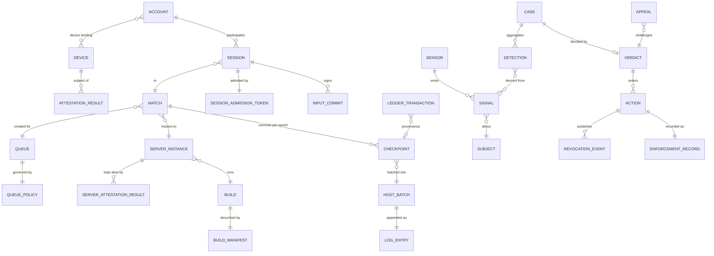
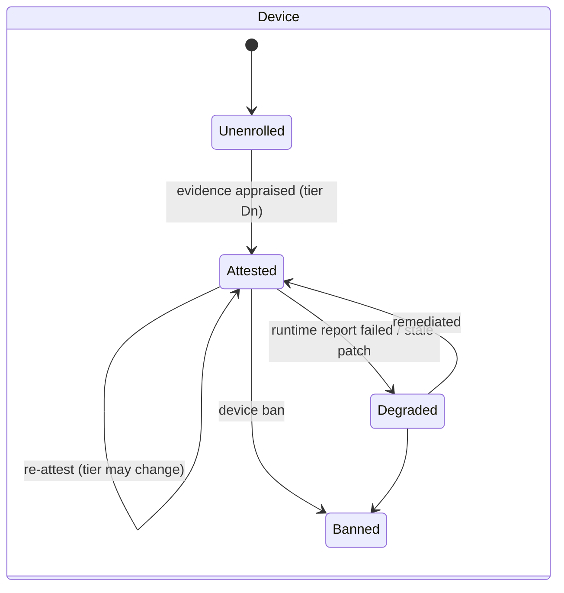
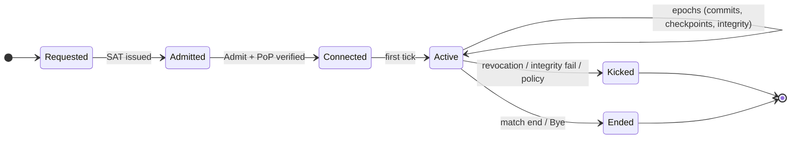
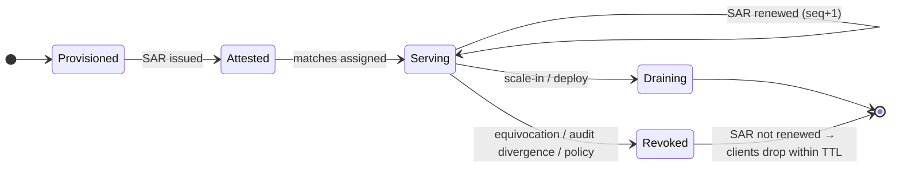
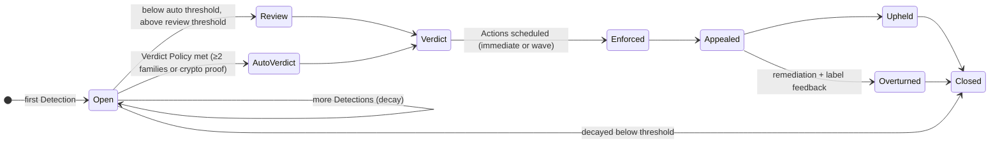

# 05 — Ontology: Review and Proposal

Question asked: *"Is the ontology good? Well thought out?"*

**Short answer: good mechanisms, immature ontology.** The prototype contains
several genuinely strong primitives: liveness-based authorization, ephemeral
keys certified by long-term identity, non-repudiable inputs, notarized
transcripts, idempotent economy operations. But the conceptual model is not yet
the right one for a worldwide, multi-title anti-cheat system:

1. It has **no domain model**, only wire messages.
2. It is centered on the **wrong adversary**. It deeply distrusts the game
   server and barely models the client, which is where most cheating happens.
3. One component, the "VS", **conflates seven roles** with incompatible
   latency, trust and scaling needs, including game-specific physics.
4. It **splits single facts across messages**, which produced two real
   exploits already.
5. **Attestation is modeled as "a hash plus an optional quote"**, not as
   Evidence → Verifier → Result.

Section 1 lists what to keep, section 2 the problems with evidence, and
sections 3–6 a replacement ontology.

---

## 0. Assessment

| Criterion | Current | Notes |
|-----------|---------|-------|
| Models the primary adversary (client / cheater) | ✗ | Client identity is a self-generated key file (`client-core/src/lib.rs` `load_or_create_client_keys`). No device, account, attestation or trust tier concepts. |
| Separation of concerns | ✗ | VS = CA + attestation verifier + liveness issuer + notary + evidence store + physics referee + revocation authority. |
| Security concepts modeled correctly | ◐ | Commitments and tickets: good instincts. Attestation, tokens, domain separation: incorrect (see §2). |
| Generality (all genres, all platforms) | ✗ | Root of trust hard-codes 2D positions and a speed limit (`vs/src/enforcer.rs:12`). |
| Naming consistency | ✗ | See §2.8. |
| Evolvability (versioning, crypto agility, language-neutral encoding) | ✗ | bincode-serialized Rust tuples; a version field that is logged but not enforced. |
| Primitives worth keeping | ✓ | See §1. |

## 1. What is good and should be kept

| Primitive in prototype | Why it is right | Where it lives in the new ontology |
|------------------------|-----------------|-------------------------------------|
| **Liveness-based authorization**: the VS keeps issuing short-lived, hash-chained `PlayTicket`s, and starvation means revocation (`vs/src/streams.rs` `spawn_ticket_loop`, `gs-sim/src/tickets.rs` watchdog) | Revocation that works even if the revoked party ignores you. Same idea as short-lived certificates. | **Server Attestation Result (SAR)**, chained with `seq`/`prev` |
| **Ephemeral session key certified by long-term key** (`JoinRequest.ephemeral_pub`) | Limits key exposure. Standard and correct. | GS instance key bound into attestation; player Session Key bound via `cnf` |
| **Signed client inputs** (`ClientInput.client_sig`) | Makes inputs non-repudiable, so a host cannot forge them and players cannot deny them | **Input Commit** (per epoch, Merkle root) |
| **Hash-chained transcript + external notarization** (`receipt_tip`, `ProtectedReceipt`) | Accountability of the host | **Checkpoint** + **Transparency Log** |
| **"Store data before signing the receipt"** (DA before `ProtectedReceipt`) | Evidence availability ordering | Evidence stored before log finality; manifest referenced from checkpoints |
| **Idempotency keys** (`SpendCoins.op_id`) | Prevents duplication | **Ledger Transaction** idempotency key |
| **Adversarial culture**: named exploits, fixes justified by attack scenarios | This is how security work should be done | Carried into the threat catalog (T-IDs) |

## 2. Problems (with evidence)

### 2.1 No domain layer

The ontology is `proto.rs`: wire structs serialized directly with bincode.
Concepts a production system must be able to express do not exist, so they
cannot be enforced, audited or reasoned about:

> Account, Device, Device binding, Trust tier, Queue policy, Match, Signal,
> Detection, Case, Verdict, Action, Appeal, Build manifest, Reference value,
> Server class, Evidence object, Revocation event.

You cannot say "ban this device", "ranked requires HVCI", "this verdict is
based on these three evidence objects", or "this server may not write economy
state".

### 2.2 Wrong center of gravity

The README frames the problem as *Client ↔ GS ↔ VS, where the client refuses to
trust GS unless VS blesses it*. That is **anti-rogue-host**, a real but
secondary problem that matters for community, partner and edge hosting. The
primary adversary in every commercial game is the **client** (T01–T14). In the
prototype:
- Client identity is a self-generated Ed25519 key. Sybil identities are free,
  so bans are meaningless (T27).
- There is no device attestation, no build measurement of the client, and no
  trust tier.
- `client_binding` is always zero (`vs/src/streams.rs:47`, `:58`), so a ticket
  authorizes *any* client.

### 2.3 The VS is a god object

| Role | Code | Needs |
|------|------|-------|
| Session CA / admission | `vs/src/admission.rs` | high availability, stateless |
| Attestation verifier | `vs/src/admission.rs:86-118`, `streams.rs` TPM branch | complex parsing, vendor roots, fuzzing |
| Liveness issuer | `vs/src/streams.rs` `spawn_ticket_loop` | per-instance stream, low latency |
| Notary | `vs/src/streams.rs` `spawn_bistream_dispatch` | append-only, publicly verifiable |
| Evidence store | `vs/src/streams.rs:401` `write_da_log` | durable, regional, encrypted |
| Game-rule referee | `vs/src/enforcer.rs` (speed limit, 2D positions) | **title-specific** logic |
| Revocation authority | `vs/src/watchdog.rs` | push fan-out |

Consequences:
- **The root of trust must understand each game's physics.** It cannot serve
  "all online games".
- It is in the synchronous path of every host's 2-second heartbeat.
- A single process-global `Mutex<Enforcer>` (`vs/src/enforcer.rs:300`)
  serializes every session on the node. One poisoned lock (`lock().unwrap()`)
  takes all sessions down.
- Compromising any one role compromises all of them.

### 2.4 One fact split across two messages

The GS commits to state in `Heartbeat` (`receipt_tip`, `snapshot_root`) but
ships the data in `TranscriptDigest` (`positions`, `da_payload`). The two
travel on different QUIC streams and must be re-paired on the VS. Two exploits
fixed in PRs #3 and #4, *Ghost Snapshot* and *Premature Notarization*, were
direct consequences. The staging map and notifier (`vs/src/ctx.rs:37`
`staged_hbs`, `hb_notify`) exist only to glue the halves back together.

**Ontology fix:** a commitment and the data it commits to are one object (a
signed **Checkpoint** whose roots cover the data), or the data is
content-addressed by the commitment. Then pairing races cannot exist.

### 2.5 Linear hash chain instead of Merkle structure

`receipt_tip = H(prev ‖ input ‖ event)` (`common/src/crypto.rs`
`receipt_tip_update`). Auditing any single event requires replaying the entire
chain, and you cannot hand a third party a compact proof that "input X was
accepted in epoch N" (appeals, disputes). Merkle roots per epoch, chained by
`prev`, give O(log n) inclusion proofs at the same cost.

### 2.6 Speed sampling is not an audit

The VS checks straight-line speed between positions sampled every ~2 s
(`vs/src/enforcer.rs` `on_transcript`). It misses teleport-and-return within a
window, wall clipping and any non-movement cheat. And the positions are
*claimed by the GS* it is auditing, so a rogue GS simply reports plausible
positions. The correct concept is **deterministic replay**: re-simulate from
committed inputs and compare `state_root`. That in turn requires a determinism
contract the simulation does not have yet (`f32` positions,
`HashMap` iteration in `gs-core`).

### 2.7 Attestation mis-modeled

In RATS terms (RFC 9334) the prototype mixes **claims**, **evidence** and
**results**:
- `sw_hash` is a *self-reported claim*: the binary hashes itself
  (`gs-sim/src/main.rs:88`). A modified binary reports the original hash. An
  allowlist of claimed hashes adds no security.
- The simulated TPM extends **PCR 0** with the app hash
  (`gs-sim/src/main.rs:99`). PCR 0 holds firmware (SRTM) measurements, so a
  Verifier cannot compare it to vendor reference values. Application
  measurements belong in the OS-level measurement log or a runtime report,
  never in platform firmware PCRs.
- The Verifier's nonce is **chosen by the attester**: the quote is checked
  against its own embedded nonce (`vs/src/admission.rs:115`
  `verify_quote(quote, &quote.nonce, …)`), whose first 16 bytes equal the
  GS-chosen `JoinRequest.nonce` (`:94`). Join nonces are not tracked, so a
  captured quote can be replayed indefinitely.
- There is no endorsement chain (`ek_cert: None`, `common/src/tpm.rs:284`,
  `:504`), no AK credential activation (`Hierarchy::Owner` primary,
  `:438`), and `HardwareTpm::extend_pcr` ignores its index and always
  extends slot 0 (`:518`). `verify_quote` only accepts Ed25519 AKs (`:155`),
  so a real TPM quote can never verify, and the quote format is not
  `TPMS_ATTEST`.

**Ontology fix:** Attester → Evidence (+ Endorsements) → Verifier (+ Reference
Values from Build Registry, Appraisal Policy) → Attestation Result → Relying
Party. Only the Verifier touches evidence.

### 2.8 Naming inconsistencies

| Term | Problem |
|------|---------|
| **VS** | "Validation Server" (`README.md:6`, `vs/src/main.rs:1`) vs "Verification Server" (`common/src/config.rs:8`, `common/src/tpm.rs:28`) |
| **session** | Means GS↔VS registration (`JoinAccept.session_id`), yet players also have sessions |
| **ticket** | A server-liveness proof, but stapled into player inputs as if it were player authorization |
| **receipt / transcript / ledger / DA** | Four words for evidence: `receipt_tip` (hash chain), `ProtectedReceipt` (notarization), `ledger` (local economy log), `da_payload` (blockchain "data availability") |
| **enforcer** | Performs physics checking, not enforcement |
| **counter / nonce** | `gs_counter`, ticket `counter`, `client_nonce`: three unrelated sequences with overlapping names |
| **client_binding = 0** | Sentinel value meaning "any client": a magic value in a security field |

### 2.9 Other structural issues

- **Three sources of truth for revocation**: `vs/src/ctx.rs:22`
  `Session.revoked`, `vs/src/enforcer.rs:33` `SessionPhysics.revoked`,
  `gs-sim/src/state.rs:103` `GsShared.revoked` (+ a watch channel).
- **No domain separation in signatures.** Each message has an ad-hoc byte
  builder, and `JoinAccept` signs the raw 16-byte `session_id`
  (`vs/src/admission.rs:143`) with the same key that signs tickets and receipts.
- **Wire types are Rust-only.** bincode over Rust tuples cannot be implemented
  by a C++ engine, Unity/C#, Kotlin or Swift client without reimplementing
  bincode's layout rules exactly.
- **Economy inside the network loop.** `SpendCoins` is handled in the client
  port handler with an in-memory LRU (`gs-sim/src/client_port.rs`). Money needs
  a durable transactional ledger.
- **Lockstep request/response transport**: one reliable-stream input → one
  snapshot. Real-time games need unreliable datagrams and ticks decoupled from
  input arrival.

---

## 3. Proposed ontology

Organized as bounded contexts (DDD). Terms in **bold** are canonical. Use them
in code, docs and dashboards, and do not introduce synonyms.

### 3.1 Identity context

| Term | Definition |
|------|------------|
| **Principal** | Anything that holds keys and can be the subject of trust decisions: Account, Device, Server Instance, Service |
| **Account** | A player identity at the platform or publisher level. Pseudonymized as `acct` outside Identity. |
| **Device** | A physical or virtual endpoint identified by a hardware-rooted identity, pseudonymized as `did` |
| **Device Binding** | Many-to-many relation Account↔Device, with first/last seen |
| **Server Instance** | One running GS process or VM, identified by `gs_instance_id` = hash of its instance key |
| **Key** | Keypair with a *role*, algorithm, custody (HSM / TPM / TEE / enclave / software), lifetime, and a `fpp-ctx` allowlist |
| **Credential** | Short-lived signed statement bound to a key (`cnf`): Attestation Result, Session Admission Token, Server Attestation Result, Key Bundle |

### 3.2 Attestation context (RFC 9334 vocabulary)

| Term | Definition |
|------|------------|
| **Attester** | Principal producing evidence about itself (Device, Server Instance) |
| **Evidence** | Platform-signed claims: TPM quote + TCG log, Windows runtime report, enclave report, Play Integrity verdict, App Attest assertion, SNP/TDX report |
| **Endorsement** | Vendor statement vouching for an attester's hardware (EK certificate, VCEK chain, attestation roots) |
| **Reference Value** | Known-good measurement from the **Build Registry** |
| **Appraisal Policy** | Versioned rules turning evidence into a result (from **Policy Service**) |
| **Verifier** | The only component that appraises evidence |
| **Attestation Result (AR)** | Verifier-signed, short-lived result for a Device: tier, features, build, `cnf` |
| **Server Attestation Result (SAR)** | Same, for a Server Instance. Doubles as the liveness credential. |
| **Relying Party** | Consumes results, never evidence: Broker, GS, client (for SAR) |
| **Device Trust Tier** | D0 Unknown · D1 Software · D2 Hardware platform · D3 Hardened |
| **Server Class** | community · partner · first_party · first_party_cvm |

### 3.3 Build and policy context

| Term | Definition |
|------|------------|
| **Title** | A game product |
| **Build** | An immutable artifact (client, server, IA, detection module) identified by `build_id` |
| **Build Manifest** | Signed measurements, provenance (SLSA) and asset hashes of a Build, transparency-logged |
| **Policy** | Signed, versioned rule set: *Queue Policy*, *Appraisal Policy*, *Verdict Policy*, *Retention Policy* |
| **Queue** | A matchmaking mode with a Queue Policy (tiers, server classes, fail mode) |

### 3.4 Play context

| Term | Definition |
|------|------------|
| **Match** | A bounded simulation instance on one Server Instance, with a roster. MMO zones and shards are long-lived Matches with a rolling roster. |
| **Session** | One Account's participation in one Match: `slot`, SAT, Session Key. *Not* the server's registration with the backend. |
| **Tick** | The authoritative simulation step. The only clock in a Match. |
| **Epoch** | A fixed group of ticks: the unit of commitment and checkpointing |
| **Input Frame** | A client's intent for one tick (title-defined payload). Never state. |
| **Input Commit** | Client-signed Merkle root over its Input Frames for one Epoch |
| **Authoritative Event** | Server-decided outcome (hit, death, item grant) in simulation order |
| **Audit Projection** | The deterministic subset of Match state that auditors replay |
| **Checkpoint** | Server-Instance-signed commitment per Match per Epoch: inputs, events, state, randomness, roster, previous |

### 3.5 Evidence context

| Term | Definition |
|------|------------|
| **Evidence Object** | Content-addressed immutable blob (frames, commits, events, proofs) in the regional Evidence Store |
| **Evidence Manifest** | Per-Match index of Evidence Objects, committed via the final Checkpoint |
| **Host Batch** | Merkle root over all Checkpoints on one host for a time window: the unit appended to the Log |
| **Transparency Log** | Append-only Merkle log. **Log Receipt** = inclusion promise. **Tree Head** = signed size + root, **cosigned** by Witnesses. |
| **Inclusion / Consistency Proof** | RFC 9162 proofs |
| **Equivocation Proof** | Two valid signatures by one key over conflicting statements for the same slot (e.g. same `(match, epoch)`) |
| **Replay** | A Replay Auditor run producing an **Audit Result** |

### 3.6 Detection context

| Term | Definition |
|------|------------|
| **Subject** | What detections and actions target: Account · Device · Session · Server Instance · Build |
| **Sensor** | A source of observations: GS validator, feature extractor, IA module, ML model, report intake, honeypot, Replay Auditor, economy analytics |
| **Signal** | One observation from a Sensor about a Subject, with evidence references. Not a judgement. |
| **Signal Family** | Independence class: *server-behavioral*, *information-use*, *client-integrity*, *attestation*, *economy*, *human-report*, *cryptographic* |
| **Detection** | A Scorer's conclusion: Subject, **Cheat Class** (T-ID from the threat model), confidence, family, rule or model version |
| **Case** | Time-decayed aggregation of Detections for one Subject |
| **Verdict** | Decision on a Case (automated per Verdict Policy, or by a reviewer), with rationale and evidence references |

The threat catalog in [01-threat-model.md](01-threat-model.md) **is** the Cheat
Class taxonomy. Threat modeling, detection engineering and enforcement
reporting share one vocabulary.

### 3.7 Enforcement context

| Term | Definition |
|------|------------|
| **Action** | Enforcement step: kind, Subject, scope, duration, timing (immediate / wave) |
| **Revocation Event** | Signed, pushed instruction derived from an Action |
| **Enforcement Record** | Immutable record of an Action (hash in the Transparency Log) |
| **Appeal** | A challenge to a Verdict, resolved with verifiable evidence |
| **Remediation** | Economy clawback, match invalidation, rank restoration for victims |

### 3.8 Economy context

| Term | Definition |
|------|------------|
| **Ledger Account**, **Asset** | Double-entry ledger entities |
| **Ledger Transaction** | Atomic mutation with an **idempotency key** and **provenance** (match, epoch, event) |

## 4. Relationships

## 5. Lifecycles

## 6. Term migration (prototype → canonical)

| Prototype term | Canonical term | Notes |
|----------------|----------------|-------|
| VS (Validation/Verification Server) | *split:* **Verifier**, **Session Broker**, **Server Liveness**, **Transparency Log**, **Replay Auditor**, **Enforcement Service** | See [03-architecture.md](03-architecture.md) §3 |
| GS | **Game Server** / **Server Instance** | Instance = the attested running thing |
| `session_id` (VS↔GS) | **Server Instance registration** (`gs_instance_id`) | "Session" is now player participation |
| `PlayTicket` | **Server Attestation Result** | |
| `ticket_counter`, `prev_ticket_hash` | SAR `seq`, `prev` | |
| `client_pub` | **Session Key** (bound to **Device Key** via AR `cnf`) | |
| `ClientInput` | **Input Frame** + **Input Commit** | |
| `client_nonce` | Input Frame `tick` (+ commit `epoch`) | Ticks replace nonces |
| `receipt_tip` | **Checkpoint** `prev` + roots | |
| `Heartbeat` + `TranscriptDigest` | **Checkpoint** | |
| `snapshot_root` | **Checkpoint** `state_root` | Over the audit projection |
| `ProtectedReceipt` | **Log Receipt** + **Tree Head** | |
| `da_payload`, `da_log/` | **Evidence Objects** in **Evidence Store** | |
| `ledger` (gs-sim) | **Ledger Transaction** (Economy) / **Evidence** (audit) | Split by purpose |
| `enforcer` | **GS validators** + **Replay Auditor** | Enforcement means Actions |
| `sw_hash` | **Build** measured → `build_id` in AR/SAR | Measured, not self-reported |
| `TpmQuote` | **Evidence** (one of several kinds) | |
| `revoked` flags | **Revocation Event** → subject state | One source of truth |
| `SpendCoins.op_id` | **Ledger Transaction** idempotency key | |
