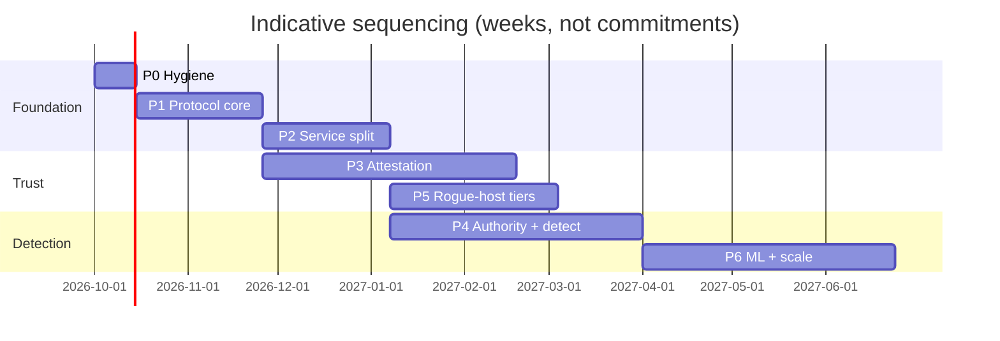

# 07 — Gap Analysis and Roadmap

Status: Draft v1. Compares the prototype (as of commit `243767a`) against
[02-requirements.md](02-requirements.md) and proposes a phased path to the
architecture in [03-architecture.md](03-architecture.md).

---

## 1. Security findings in the current code

Severity reflects the prototype's own stated goals (anti-rogue-host,
anti-cheat, audit trail). Most are expected in a prototype. They are listed
because several **chain together**.

| ID | Sev | Finding | Location | Fix (phase) |
|----|-----|---------|----------|-------------|
| F01 | **Critical** | TLS certificate verification disabled on client→GS and GS→VS. A network or local proxy can read and alter unsigned traffic (snapshots) and impersonate either server. | `crates/client-core/src/lib.rs:33,51`; `crates/gs-sim/src/main.rs:359,401-402` | ✅ Fixed (P0): dev CA + CA-signed VS/GS certificates (`common::pki`); insecure verifiers removed |
| F02 | **Critical** | The GS does not pin the VS key: it verifies `JoinAccept` with the `vs_pub` *contained in the same message*, then trusts tickets signed by that key. Combined with F01, any MITM or fake VS can "bless" a GS. | `crates/gs-sim/src/main.rs:173,181` | ✅ Fixed (P0), then superseded (P2.4): the GS reaches Server Liveness only over TLS to the pinned CA and name (F01), and what blesses it is its SAR chain under the Server Liveness key in its bundle (every SAR must certify its own keys; clients play only under one); `JoinAccept` carries no key or signature of its own |
| F03 | **High** | The client verifies the VS signature and freshness only on the first ticket. `TicketUpdate`s are accepted unverified and freshness is computed but ignored. **F01 + F02 + F03 = revocation bypass**: after the handshake a revoked GS (or a MITM feeding it tickets) keeps clients playing. | `crates/client-core/src/lib.rs:335,401-403` | ✅ Fixed (P0): `common::tickets::TicketChain` verifies every update (signature, session, chain, expiry); GS forwards every ticket in order |
| F04 | **High** | TPM quote freshness is attester-controlled. The VS checks the quote against its *own* nonce, whose first 16 bytes equal the GS-chosen `JoinRequest.nonce`, and join nonces are not tracked. A captured quote can be replayed forever. | `crates/vs/src/admission.rs:94,115` | ✅ Fixed in the prototype: VS-issued single-use `AttestChallenge` per connection, quote bound to it and to the signed JoinRequest; re-attestation quotes seeded by a recent VS ticket signature (`vs/src/attest.rs`). The Verifier (P3) keeps the same rule. |
| F05 | **High** | Hardware TPM path is non-functional or incorrect: `extend_pcr` ignores its index (always slot 0); `verify_quote` rejects non-Ed25519 AKs and does not parse `TPMS_ATTEST`, so real quotes can never verify; no EK chain or AK credential activation. The docs (`TPM_GUIDE.md`) and the code disagree on what is implemented. | `crates/common/src/tpm.rs:155,284,438,504,518` | ✅ Real TPM 2.0 appraisal: `crates/attest-tpm` (quotes with RSA/ECDSA AKs, EK certificate chains to pinned manufacturer roots, credential activation, boot-log replay with Secure Boot's state) and Server Liveness's GS admission (`svc-liveness --tpm-ek-roots`, `svc-liveness/src/tpm2.rs`), with the GS gathering evidence through tpm2-tools (`gs-sim --tpm2`). The dead `hardware-tpm` provider (it never compiled) is removed and `TPM_GUIDE.md` rewritten to match. Tested end to end against swtpm in CI. Open: TPM 2.0 re-attestation during a session; `dbx` currency |
| F06 | **High** | `sw_hash` is self-reported (the binary hashes itself), and PCR 0 is extended with an app hash. The allowlist and "attestation" provide no assurance against a modified GS. | `crates/gs-sim/src/main.rs:88,99` | ✅ Server Liveness takes a GS's build from the kernel's IMA measurement (replayed against the quoted PCR 10), requires it in a Build Registry (`svc-liveness --build-registry`), and refuses a GS whose own `sw_hash` differs or that brings no TPM evidence. CI builds the GS with signed SLSA provenance and publishes each build's registry line (`gs-release.yml`). Tested against swtpm: a modified GS that really ran is refused. Open: runtime integrity after start (confidential VM, P5) |
| F07 | Medium | Unbounded allocation from a peer-controlled length prefix on the VS bi-stream path (bypasses the 16 MiB cap in `framing::recv_msg`). An admitted GS can force up to 4 GiB allocations per stream. | `crates/vs/src/streams.rs:110` | ✅ Fixed (P0): `framing::recv_msg_max`, 64 KiB default cap, explicit caps for snapshots (1 MiB) and transcripts (4 MiB) |
| F08 | Medium | No timeout on accepting or reading the `JoinRequest`: idle connections hold VS tasks indefinitely (slowloris). | `crates/vs/src/admission.rs:30-34` | ✅ Fixed (P0): `admission_timeout_ms` deadline + QUIC Retry address validation |
| F09 | Medium | Process-global `Mutex<Enforcer>` shared by all sessions, with `lock().unwrap()`. It serializes all sessions, and one panic poisons every session. | `crates/vs/src/enforcer.rs:300` | Per-session state; remove from VS (P2) |
| F10 | Medium | `PlayTicket.client_binding` is always zero, so a ticket is a bearer credential usable by any client. | `crates/vs/src/streams.rs:47,58` | ✅ Fixed (P1): PlayTickets are gone; admission uses a SAT bound to the session key (`cnf`), proven in the handshake; a stolen SAT is rejected (`client-core/tests/session_attacks.rs`) |
| F11 | Medium | No domain separation in signatures. `JoinAccept` signs the raw 16-byte `session_id` with the same key that signs tickets and receipts. | `crates/vs/src/admission.rs:143` | ✅ Fixed (P1) for every FPP object: tokens, Checkpoints, InputCommits and AdmitPops are COSE with `fpp-ctx` and per-role keys (Verifier, Broker, Liveness keys are distinct). `JoinAccept` no longer carries a signature (P2.4, see F02), and each role key is now made by its own service, not derived from one seed |
| F12 | Medium | Protocol version mismatch is logged but the session proceeds. | `crates/gs-sim/src/client_port.rs:258` | ✅ Fixed (P1): control links reject an unknown `ChallengeRequest.version`; fpp-session binds its version in the Noise prologue and handshake payloads; tokens carry `fpp-v` |
| F13 | Medium | The VS "physics" check uses GS-claimed positions and GS-claimed time, sampled every ~2 s. It does not constrain a rogue GS and is bypassed by teleport-and-return. | `crates/vs/src/enforcer.rs` | ✅ Removed from the trust plane (P1): the VS no longer sees positions; the GS clamps intent (AUTH-01) and signs per-epoch Checkpoints over applied inputs and state. ✅ `fpp-audit` (M4, 04 §8.5) verifies Checkpoints independently from players' evidence bundles (signatures, chains, roots, acknowledgements, an outcome for every input, equivocation across bundles). Open: re-simulation (was each decision right?), which needs a title's headless build |
| F14 | Low | Evidence ("DA log") is written to local files in the working directory: no integrity, durability or replication. | `crates/vs/src/streams.rs:401-420` | ✅ P2.3: the Evidence Store (`svc-evidence`), content addressed and checked on every read, written by Server Liveness only. Open: replication, retention, encryption at rest |
| F15 | Low | Private key material is committed (`crates/client-core/keys/client_ed25519.pk8`, presumably a test key). `.pk8` files hold raw 32-byte seeds, not PKCS#8. | repo | ✅ Fixed (P0): keys untracked, `crates/*/keys/` ignored, CI guard fails on tracked key files |
| F16 | Low | `cargo audit \|\| true`: advisories never fail CI. | `.github/workflows/ci.yml:39` | ✅ Fixed (P0): cargo-deny (advisories, licenses, bans, sources) is a blocking CI job; see F20 |
| F17 | Low | `.gitignore` ignores `*.lock` while `Cargo.lock` is tracked. Lockfiles for binaries must be tracked for reproducible builds. | `.gitignore:23` | ✅ Fixed (P0) |
| F18 | Info | Revocation state lives in three places. | `vs/src/ctx.rs:22`, `vs/src/enforcer.rs:33`, `gs-sim/src/state.rs:103` | ✅ P2.2: one source, the Revocation Feed's signed events; the Broker, Server Liveness and game servers each keep a cache of it |
| F19 | Info | GS client port is hard-coded to `127.0.0.1:50000`. | `crates/gs-sim/src/client_port.rs:78` | ✅ Fixed (P1): `--game-addr`, advertised to the VS in the signed JoinRequest and to clients by the Broker |
| F22 | Medium | Post-quantum authenticity is claimed further than it reaches. The Log key signs hybrid (Ed25519 + ML-DSA-65), but the only verifiers of the ML-DSA half are the witness and the log itself (checking its own checkpoint on reopening). Clients, game servers and the cell services never call hybrid verification, and the C SDK is built without `s1h`, so it cannot; `LogReceipt`s are hybrid-signed but checked by no one; Go's sumdb, like any C2SP verifier, checks only the Ed25519 line of a checkpoint; the independent Python verifier has no ML-DSA. Every object a relying party checks today (AR, SAT, SAR, Checkpoint, RevocationEvent) is Ed25519-only (FPP-S1, as 04 §3 intends for short-lived objects). Against a quantum forger, the log is protected only as far as its witness is. | `crates/fpp-log/src/witness.rs:83`, callers of `verify_hybrid` / `Note::verify_hybrid` (only fpp-log) | ◐ Partially addressed. Docs corrected (04 §3, P2.1 below). Players now verify both halves of every log checkpoint they rely on (P2.5, `client-core::transparency`). Still open: the C SDK (no `s1h`), `LogReceipt`s checked by no one, Ed25519-only witness cosignatures, build manifests and policies (P3), ML-DSA vectors for the independent verifier |
| F21 | **Critical** | `verify_quote` checked a quote's signature with the attestation key *carried in the quote*. Anyone could sign a "quote" for any PCR values, including the configured baselines, with a key they made up; PCR baselines gave no assurance. | `crates/common/src/tpm.rs` `verify_quote` | ✅ Fixed for TPM 2.0: an AK counts only after credential activation against an EK certified by a pinned manufacturer root, at every join. The simulated TPM path is removed |
| F20 | **High** | Vulnerable dependencies, hidden by the non-blocking audit (F16): quinn-proto remote DoS and memory exhaustion (RUSTSEC-2026-0037, -0185), rustls accepting TLS 1.3 handshake messages across encryption levels (RUSTSEC-2026-0285), rustls-webpki name-constraint and CRL flaws, aws-lc-sys X.509/PKCS7 bypasses, unsound `lru` used directly by gs-sim, protobuf recursion crash via prometheus 0.13, plus bytes, time and anyhow issues. | `Cargo.lock`, `crates/gs-sim/Cargo.toml`, `Cargo.toml` | ✅ Fixed (P0): lockfile updates, lru 0.18, prometheus 0.14; remaining ignores documented in `deny.toml` (bincode, until P1 replaces it) |

## 2. Requirements coverage

`✓` met · `◐` partial / prototype-grade · `✗` missing

| Area | Status | Summary |
|------|--------|---------|
| AUTH (server authority) | ◐ | Movement clamped server-side (`MAX_STEP`) and token-bucket rate limits. No tick model, no lag-comp bounds, no VRF, no determinism contract. |
| INFO (information minimization) | ✗ | `WorldSnapshot.others` sends every player's position to every client: a built-in ESP. |
| ATT (attestation) | ◐ | Game servers: real TPM 2.0 admission (EK chain, credential activation, quote, boot and IMA logs, a Build Registry of CI builds with provenance; F05/F06/F21), tested end to end against swtpm; re-attestation during a session is TBD (the simulated TPM path is removed). Freshness (F04) and self-asserted AKs (F21) fixed in the prototype. No client attestation yet, but player-hosted joins now carry an AR slot (04 §7.7). |
| ID (identity) | ✗ | Self-generated client keys; no account, device, or ban-durable identity. |
| PROTO (protocol/crypto) | ◐ | QUIC + Ed25519 are good foundations. Unverified TLS, bincode tuples, no domain separation or versioning, no PQ, no datagrams. |
| EVD (evidence) | ◐ | Hash-chained Checkpoints and InputCommits, players' evidence bundles and `fpp-audit` (P1, M4); a Transparency Log with a witness (P2.1); a content-addressed Evidence Store (P2.3); every Checkpoint in the log, checked by players, a split view reported and revoked automatically (P2.5, EVD-02/03; one witness, not two). Not yet replicated or encrypted at rest. |
| IA (Integrity Agent) | ✗ | Not started. |
| DET (detection) | ✗ | Only the VS speed check. |
| ENF (enforcement) | ◐ | Signed revocation events for accounts, devices, sessions, SATs, instances and builds, through a logged feed to Brokers, Server Liveness and game servers (P2.2); instance revocation also by SAR starvation. No appeals or two-person rule yet. |
| ECO (economy) | ◐ | Idempotency via LRU in GS memory; not durable or transactional. |
| NET | ✗ | Not addressed. |
| SEC (AC security) | ◐ | Rust (good); CI audit non-blocking; no fuzzing; keys in repo. |
| PRIV | ✗ | Not addressed. |
| OPS | ◐ | One regional cell of separate services (P2.4, `deploy/cell`); no multi-region, capacity model or documented fail modes yet. |
| PLAT | ✗ | Desktop Rust client only. |
| GOV | ✗ | Not addressed. |

## 3. Target workspace layout

The ontology ([05-ontology.md](05-ontology.md)) maps directly onto crates.
Domain crates have no I/O, which makes them portable to the client SDK, WASM
and every service.

```text
crates/
  fpp-types/          # ontology: ids, tiers, server classes, subjects, reason codes (no I/O)
  fpp-wire/           # deterministic CBOR + COSE, message catalog, versioning, size caps
  fpp-crypto/         # suites, key roles + fpp-ctx allowlists, custody traits (HSM/TPM/TEE/sw)
  fpp-merkle/         # RFC 9162 trees, inclusion/consistency proofs
  fpp-tokens/         # AR / SAT / SAR (CWT/EAT) builders + verifiers
  attest-core/        # RATS appraisal engine, policy evaluation, tier computation
  attest-tpm/         # TPM2 quote + TCG log replay + EK chain (Verifier side)
  attest-windows/     # runtime attestation report, VBS enclave report parsing
  attest-android/     # Play Integrity + key attestation chain (key attestation ✅)
  attest-apple/       # App Attest (✅)
  attest-cvm/         # SEV-SNP / TDX reports
  gs-authority/       # tick loop, jitter buffer, validators trait, interest mgmt, lag-comp bounds
  gs-checkpoint/      # epoch accumulators, VRF, checkpoint signing, host batching
  sim-determinism/    # fixed-point math, ordered collections, lints for audit projection
  ia-core/            # Integrity Agent runtime + wasmtime module host
  ia-ffi/             # C ABI (cbindgen), versioned symbols
  svc-verifier/  svc-broker/  svc-liveness/  svc-tlog/  svc-auditor/
  svc-ingest/    svc-case/    svc-enforcement/  svc-ledger/
tools/  fuzz/  (cargo-fuzz targets for every decoder)
```

Existing crates migrate: `common` → `fpp-*`, `gs-sim` →
`gs-authority` + `gs-checkpoint`, `vs` → `svc-*` (✅ split, P2.4), `client-core` →
`ia-core` + reference client, `client-bevy` stays as reference client.

## 4. Roadmap

Each phase ends with an exit criterion that is testable in CI or by a game day.

### P0 — Hygiene and correctness ✅ done
Fixed F01–F03, F07, F08, F15–F17 and F20. Unified VS naming. cargo-deny is
blocking (it uses the RustSec database, so it subsumes `cargo audit`). Fuzz
targets cover every wire decoder and verifier of untrusted input.
**Exit criterion, as met:** automated attack tests instead of a proxy harness,
since verified TLS leaves a proxy nothing to do but drop packets:
- impersonating VS or GS with a certificate from another CA, or for another
  name, is refused (`crates/common/tests/pki_tls.rs`,
  `crates/client-core/tests/gs_impersonation.rs`);
- a fake VS advertising its own key is refused by the GS
  (`crates/gs-sim/tests/join_accept_pinning.rs`);
- forged, replayed, skipped, forked and expired tickets are refused, and a
  client stops once tickets stop arriving, which is what revocation does
  (`crates/common/tests/ticket_chain_client.rs`);
- oversized frames are rejected before allocation and idle peers are dropped
  at the admission deadline (`crates/common/tests/framing_limits.rs`,
  `crates/vs/src/admission.rs` tests);
- `cargo +nightly fuzz run wire_decode` / `verify_untrusted` run in CI.

### P1 — Protocol core v1 ✅ done
**Slice 1 ✅ (foundation):** `fpp-types`; `fpp-wire` (strict deterministic
CBOR codec, COSE_Sign1 container, `InputCommit` / `InputLeaf` / `Checkpoint`);
`fpp-crypto` (key roles with context allowlists, `kid`, sign/verify in the
normative order of 04 §2.1); `fpp-merkle` (RFC 9162 trees with inclusion and
consistency proofs, checked against the CT reference tree). Golden vectors in
`interop/vectors/fpp1.json` (5 valid chained objects, 16 negative ones) are
verified both by the Rust test and by an independent standard-library Python
implementation (`interop/python/fpp_interop.py`, run by `make ci`). Fuzz
target `fpp_decode` asserts that every accepted encoding is canonical.
Found while building: RFC 9162 proofs do not authenticate tree size, so
Checkpoint roots now carry leaf counts.
**Player-hosted session ✅ (milestone M2):** `fpp-session` (Noise IK,
replay window, path validation, AdmitPop session-key binding, AR slot) and the
`fpp_p2p_*` C ABI; spec in 04 §7.7. Per ADR-002 it is also the native data
plane for dedicated servers; it gained a reliable ordered channel and join
cookies.
**Tokens and admission ✅:** `fpp-tokens`: AR, SAT and SAR (04 §6) with
`cnf` binding, lifetimes and the SAR chain (`SarChain`), the §7.2 admission
checks (`admission::admit`), the control messages shared by both transports,
and the TLS-exporter Admit PoP for QUIC (`control::quic_pop`). Golden vectors
for all three tokens pass the Python verifier.
**Prototype on FPP ✅:** the VS issues SARs instead of PlayTickets, verifies
one signed Checkpoint per epoch instead of Heartbeat + TranscriptDigest
(chain, instance key, match), and acts as stub Verifier + Broker (AR, SAT,
queue tier floors); the GS serves its match over `fpp-session` with
InputFrames, InputCommits, CheckpointHeads and SarUpdates; the client admits
through the VS and stops when the SAR chain lapses. The P0 attack tests moved
to the new flow (`client-core/tests/session_attacks.rs`, `fpp-tokens`
tests). The VS physics check is gone (F13).
**Transport ✅:** QUIC control links use aws-lc-rs with `X25519MLKEM768`
preferred (FPP-T1); native game data uses `fpp-session` (ADR-002).
**Moved out of P1 by ADR-002:** a QUIC/WebTransport *game* server for browser
clients. Its messages, admission checks and PoP binding are implemented and
tested in `fpp-tokens`; the server itself belongs with the browser client.

Planned scope:
`fpp-types`, `fpp-wire`, `fpp-crypto`, `fpp-merkle`, `fpp-tokens`. COSE + CBOR
with domain separation. SAT/SAR/AR types with PoP and TLS-exporter binding.
ALPN versioning. Switch rustls/quinn to aws-lc-rs with X25519MLKEM768 preferred.
Input datagrams + InputCommits. Single signed Checkpoint replaces the
Heartbeat/TranscriptDigest pair.
**Exit:** golden test vectors for every signed object, verified by an
independent second implementation (e.g. a small Python or Go verifier) to prove
language neutrality. Protocol spec and code agree.

### P2 — Split the VS into services (4–6 weeks)
Verifier (stub appraisal), Broker, Server Liveness (SAR chain), Transparency
Log (tiles + one internal witness), Evidence Store (object storage), Revocation
Feed. Remove physics from the trust plane. One regional cell with an
infrastructure-as-code deployment.
**Exit:** revocation→kick ≤ 5 s p99 in a load test; the Log produces
inclusion/consistency proofs; the SAR lapse test disconnects clients of a
rogue GS that ignores revocation.
**Transparency Log ✅ (P2.1):** `fpp-log` is an RFC 9162 log stored as C2SP
`tlog-tiles`, with `tlog-checkpoint` signed notes, witness cosignatures
(`cosignature/v1`), hybrid-signed `LogReceipt`s and inclusion/consistency
proofs. Suite FPP-S1H (Ed25519 + ML-DSA-65 `COSE_Sign`, `fpp-crypto`
feature `s1h`) is implemented for it: the Log key is hybrid, as §4
requires. It is *verified* hybrid by the witness, the log on reopening and, since
P2.5, players checking their Checkpoints; standard C2SP verifiers (Go's
sumdb included) check only the Ed25519 line (F22). `svc-log` and `svc-witness` run as separate processes with their
own keys; `fpp-svc` gives every service a cell identity, mutual TLS over
QUIC and per-request caller authorization (only configured writers append,
only witnesses cosign). The witness refuses rollbacks and split views and
remembers across restarts. Go's `golang.org/x/mod/sumdb` independently
verifies the checkpoint, every tile, every entry and inclusion proofs
(`interop/go/tlog`, in CI).
**Service split ✅ (P2.4):** the VS is gone. `svc-liveness` (GS admission
with TPM 2.0, the SAR chain, Checkpoints, watchdog), `svc-verifier`
(evidence → AR) and `svc-broker` (AR → SAT) are separate processes, each
with its own key made in its own cell directory (`fpp-svc::keys`; nothing
is derived from a shared seed) and its own public TLS certificate. Clients
go to the Verifier, then the Broker; the Broker asks Server Liveness for a
slot over the cell's mutual TLS (only the Broker may). The key bundle is
gathered from what each service publishes. A cell runs as three containers
that each mount only their own key directory (`deploy/cell`), or as three
processes (`tools::cell`, the smoke test). Tested: a client through all
three; an AR signed by the Broker's or Liveness's key, or used by another
key, is refused; a non-Broker caller cannot place players; with Server
Liveness stopped the Verifier and Broker keep answering and the Broker
refuses within 2 s (`svc-broker/tests/cell.rs`, `make ci` smoke).
**Revocation Feed ✅ (P2.2):** `RevocationEvent` (04 §9) is a signed FPP
object under the Enforcement key, with golden vectors checked by the
independent Python verifier. `fpp-enforce` logs an enforcement record in
the Transparency Log and publishes the event naming its hash;
`svc-revocation` accepts only Enforcement's signature, appends every event
to the log before accepting it, persists them, and serves them by long
poll to the Broker (refuses denied accounts, devices, session keys,
builds) and Server Liveness (stops a revoked instance's SARs, relays every
event to its game servers, which verify it and remove the players it
names). **Exit tests** (`tools/src/revocation_load.rs`, in `make ci`):
revocation→kick p99 111–222 ms over 32 players (bound 5 s; 42 ms over 60 in a
release build); a denied account is refused; a rogue GS that ignores its
revocation loses all its players to SAR lapse in 5–6.2 s (bound: one SAR
lifetime). Scopes by region (Liveness, Broker) and queue (Broker) are
honored. Open: the regional compacted topic and Bloom filter of §9 (one
feed per cell today), scopes by title, and appeals.
**Evidence Store ✅ (P2.3):** `svc-evidence` stores objects under the
SHA-256 of their bytes, indexed by match, and re-checks every object on
every read (a corrupted disk is refused, not served; the client checks
again). Only Server Liveness writes (every Checkpoint it verified, queued
and retried so a store outage never holds up SARs); only `audit` and
`enforcement` read (`fpp-evidence`). The smoke test reads a match's
Checkpoints back as an auditor and checks they form one chain. Open:
replication across the region, retention, encryption at rest.
**Client-verifiable transparency ✅ (P2.5, EVD-02, EVD-03):** Server
Liveness appends a checkpoint leaf (match, epoch, SHA-256 of the signed
Checkpoint) for every Checkpoint it verifies, batched and retried so a log
outage never holds up SARs (`fpp-log::leaf`, `svc-liveness::transparency`).
Game servers send players the signed Checkpoint itself (`CheckpointHead`,
04 §7.6), which the client verifies under its SAR's `cnf`. The log serves
players on a public endpoint (`svc-log --public`, port 4447): for a head it
answers with an inclusion proof, or with the conflicting leaf and its proof,
against its latest witness-cosigned checkpoint (the log keeps it across
appends and restarts). The client (`client-core::transparency`) requires
both halves of the log's hybrid signature (Ed25519 and ML-DSA-65), a
cosignature from a witness in its key bundle, and the inclusion proof; a
proven conflict goes to Server Liveness as an `EquivocationReport`, which
checks it, logs an equivocation leaf and revokes the instance. **Exit test**
(`tools/src/split_view.rs`, in `make ci`): a rogue `gs-sim
--equivocate-from 3` gives Server Liveness one Checkpoint and its player
another; the honest epochs are proven logged, the split view is caught,
reported and revoked in ~50 ms, a second conflicting head is again a proof,
and the player's session ends 1 s after the report (bound: one SAR
lifetime). The smoke test's client checks every head of its match. Open:
one witness (EVD-02 asks for two, one outside the publisher); reports are
judged only while Server Liveness still holds the match (a later proof goes
to Enforcement by hand); a head never logged proves nothing by itself; the
C SDK checks a server's SAR chain and its heads' signatures
(`fpp_sar_chain_*`, `fpp_verify_checkpoint`; the Halo client does, H5) but
not yet their inclusion in the log.
**P2 status:** all five parts and their exit tests are done, in one regional
cell of separate processes and keys (`tools::cell`, `deploy/cell` in CI,
`deploy/pi`). What P2 left open is listed under each part above; the cross-cutting gaps are multi-region deployment, service metrics, and TPM
2.0 re-attestation during a session.

### P3 — Real attestation (8–12 weeks, parallelizable per platform)
Verifier appraisal for TPM 2.0 (EK chain, credential activation, TCG log
replay), Windows runtime attestation reports, Android (Play Integrity + key
attestation), Apple (App Attest). Build Registry with SLSA provenance.
Device ID (DID) and tiers. IA core with platform adapters and the C ABI.
**Mobile slice ◐ done** ([10](10-attestation-and-secure-boot.md)):
`attest-core`, `attest-android` (key attestation to Google's roots,
revocation list, verified boot, app identity) and `attest-apple` (App Attest
attestations and assertions), wired into the VS; evidence bound to the VS
challenge and the session key; C SDK `fpp_attest_challenge` and
`fpp_evidence_*`; reference Kotlin and Swift adapters. External signers
in the C SDK; `attest-tpm` for game servers (10 §5).
**P-256 session keys ✅ (P3.1):** a session key is Ed25519 or ES256
(P-256, low `s`) end to end: AR/SAT `cnf`, AdmitPop, InputCommits, the
Verifier's and Broker's proofs of possession, revocations, the C SDK
(`fpp_signer_external_p256` and `_key` variants, additive), golden vectors
checked by the independent Python verifier. A session test plays a whole
match with a P-256 key and the smoke client uses one. StrongBox reaches
D2. Fixed with it: an Android key that is itself the session key could
not carry its own public key in its attestation challenge; it now binds
`attest_challenge_hw_key` and must equal the session key (10 §5).
**PC TPM clients ✅ (P3.2):** the Verifier appraises a PC's TPM 2.0: EK
chain to a pinned manufacturer, quote over the challenge and session key,
the boot log explaining every quoted PCR, Windows' boot configuration
(test-signing, debuggers, code integrity, VBS, HVCI, boot DMA protection)
from the WBCL, a session key made in and certified by the TPM, and
credential activation as a second round trip (10 §5). Windows with Secure
Boot and a clean kernel is D2; test-signing or Secure Boot off is D0;
Linux is D1.
**Exit ✅ (P3, PC):** `tools/src/attestation_exit.rs` in `make ci`, on
swtpm: replayed quote rejected; software TPM (unpinned manufacturer)
rejected; a guessed credential rejected; test-signing and HVCI-off
machines in the right tiers (D0; D2 with `hvci: false`); the tier drives
matchmaking (`verified` admits D2 and plays, refuses D0/D1; `hardened`
(D3) refuses all, since nothing runtime-attests yet). Not yet on a real
Windows machine.
**Play Integrity and client builds ✅ (P3.3, P3.4):** Play Integrity
verdicts decrypted and verified by the Verifier with the app's response
keys; with them configured, Android D2 needs `MEETS_STRONG_INTEGRITY`. A
client Build Registry maps attested app versions to build ids: the AR's
`client_build` is attested where the platform attests it, and an
unregistered version is at most D1 (10 §5).
**P3 status:** done for PC (TPM) and Android, with the exit tests. Open:
D3 (Windows `GetRuntimeAttestationReport`, nothing appraises it); a real
Windows machine's WBCL and a real device's evidence and Play Integrity
token (all tests use formats as documented); a TPM evidence builder in the
C SDK; Play Integrity device recall; persistent App Attest keys; client
builds on platforms that do not attest them (Windows, iOS); TPM 2.0
re-attestation during a session.
**Exit:** red-team tests: replayed quote rejected; software TPM rejected;
test-signing/HVCI-off machine lands in the correct tier; tier drives
matchmaking in a staging queue.

### P4 — Authority kernel, determinism and detection foundation (8–12 weeks)
Tick-based `gs-authority` with jitter buffer, validators trait, bounded lag
compensation, **interest management** (removes the built-in ESP), deterministic
audit projection and Replay Auditor. Feature extraction → ingest → rules-based
scorers → Case Manager → Enforcement with appeals.
**Exit:** cross-platform golden replays bit-identical (x86-64 and aarch64);
honeypot and information-use Signals fire in a scripted ESP test; the
end-to-end Signal→Verdict→Revocation path is traced to evidence IDs.

### P5 — Rogue-host tiers and confidential computing (6–8 weeks)
GS images for SEV-SNP/TDX, report binding the instance key, S-Partner class,
100% audit path, client checkpoint gossip and equivocation proofs, external
witness.
**Exit:** an injected rogue GS (forged input, ground RNG, split view) is
detected and revoked automatically in a game day.

### P6 — ML and scale (ongoing)
Aim-kinematics and economy-graph models (shadow → canary → enforce), model
governance, multi-region cells, capacity tests at the 10 M CCU design point,
privacy program (DPIAs, retention automation).

### P7 — Optional privileged components (per title demand)
VBS enclave for session keys (E3). Kernel component (E2) only for titles whose
threat profile justifies it after P3 data is in.



## 5. Open questions for the team

1. **Genre focus for v1.** Competitive shooter (ESP/aim dominant), MMO
   (bots/economy dominant), or both? This sets the order of P4's detectors.
   *If the Halo: CE port becomes the reference title
   ([08](08-reference-title-halo.md)), the answer is shooter-first.*
2. **Hosting model.** Will there be partner, community or edge hosts? If not,
   P5 can be deferred and first-party servers stay at S-FirstParty.
   *With Halo, games are player-hosted, so rogue-host accountability (P5's
   evidence and replay parts) moves up, ahead of confidential VMs.*
3. **Kernel component appetite.** Are we willing to ship a driver for any
   title, given platform direction and liability? The design works without one.
4. **Platforms at launch.** Consoles need NDA SDK access early (E4).
5. **Regions and residency.** Including whether a mainland-China deployment is
   in scope.
6. **Determinism budget.** Can the audit projection cover full movement and
   combat, or only economy and outcome events?
