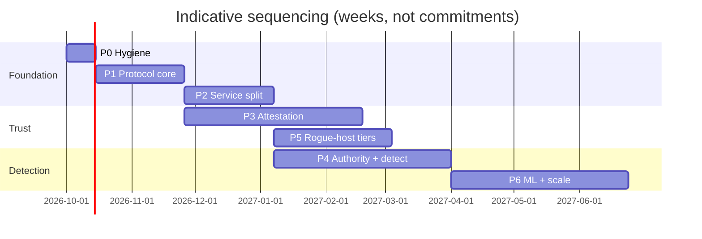

# 07 — Gap Analysis and Roadmap

Status: Draft v1. Compares the prototype (as of commit `243767a`) against
[02-requirements.md](02-requirements.md) and proposes a phased path to the
architecture in [03-architecture.md](03-architecture.md).

---

## 1. Security findings in the current code

Severity reflects the prototype's own stated goals (anti-rogue-host,
anti-cheat, audit trail). Most are expected in a prototype. They are listed
because several **chain together**.

| ID | Sev | Finding | Location | Fix (phase) |
|----|-----|---------|----------|-------------|
| F01 | **Critical** | TLS certificate verification disabled on client→GS and GS→VS. A network or local proxy can read and alter unsigned traffic (snapshots) and impersonate either server. | `crates/client-core/src/lib.rs:33,51`; `crates/gs-sim/src/main.rs:359,401-402` | Real CA + pinning; compile out insecure verifiers (P0) |
| F02 | **Critical** | The GS does not pin the VS key: it verifies `JoinAccept` with the `vs_pub` *contained in the same message*, then trusts tickets signed by that key. Combined with F01, any MITM or fake VS can "bless" a GS. | `crates/gs-sim/src/main.rs:173,181` | Pin VS key bundle on GS (P0) |
| F03 | **High** | The client verifies the VS signature and freshness only on the first ticket. `TicketUpdate`s are accepted unverified and freshness is computed but ignored. **F01 + F02 + F03 = revocation bypass**: after the handshake a revoked GS (or a MITM feeding it tickets) keeps clients playing. | `crates/client-core/src/lib.rs:335,401-403` | Verify every update, chain and expiry; disconnect on lapse (P0) |
| F04 | **High** | TPM quote freshness is attester-controlled. The VS checks the quote against its *own* nonce, whose first 16 bytes equal the GS-chosen `JoinRequest.nonce`, and join nonces are not tracked. A captured quote can be replayed forever. | `crates/vs/src/admission.rs:94,115` | Verifier-issued single-use nonces (P1) |
| F05 | **High** | Hardware TPM path is non-functional or incorrect: `extend_pcr` ignores its index (always slot 0); `verify_quote` rejects non-Ed25519 AKs and does not parse `TPMS_ATTEST`, so real quotes can never verify; no EK chain or AK credential activation. The docs (`TPM_GUIDE.md`) and the code disagree on what is implemented. | `crates/common/src/tpm.rs:155,284,438,504,518` | Replace with Verifier-side appraisal (P3) |
| F06 | **High** | `sw_hash` is self-reported (the binary hashes itself), and PCR 0 is extended with an app hash. The allowlist and "attestation" provide no assurance against a modified GS. | `crates/gs-sim/src/main.rs:88,99` | Measured launch / CVM + Build Registry (P3/P5) |
| F07 | Medium | Unbounded allocation from a peer-controlled length prefix on the VS bi-stream path (bypasses the 16 MiB cap in `framing::recv_msg`). An admitted GS can force up to 4 GiB allocations per stream. | `crates/vs/src/streams.rs:110` | Use capped decoder everywhere (P0) |
| F08 | Medium | No timeout on accepting or reading the `JoinRequest`: idle connections hold VS tasks indefinitely (slowloris). | `crates/vs/src/admission.rs:30-34` | Handshake deadlines, QUIC address validation (P0) |
| F09 | Medium | Process-global `Mutex<Enforcer>` shared by all sessions, with `lock().unwrap()`. It serializes all sessions, and one panic poisons every session. | `crates/vs/src/enforcer.rs:300` | Per-session state; remove from VS (P2) |
| F10 | Medium | `PlayTicket.client_binding` is always zero, so a ticket is a bearer credential usable by any client. | `crates/vs/src/streams.rs:47,58` | PoP-bound SAT (P1) |
| F11 | Medium | No domain separation in signatures. `JoinAccept` signs the raw 16-byte `session_id` with the same key that signs tickets and receipts. | `crates/vs/src/admission.rs:143` | COSE + `fpp-ctx` allowlists (P1) |
| F12 | Medium | Protocol version mismatch is logged but the session proceeds. | `crates/gs-sim/src/client_port.rs:258` | Reject; ALPN versioning (P1) |
| F13 | Medium | The VS "physics" check uses GS-claimed positions and GS-claimed time, sampled every ~2 s. It does not constrain a rogue GS and is bypassed by teleport-and-return. | `crates/vs/src/enforcer.rs` | GS validators + deterministic Replay Auditor (P2/P4) |
| F14 | Low | Evidence ("DA log") is written to local files in the working directory: no integrity, durability or replication. | `crates/vs/src/streams.rs:401-420` | Evidence Store (P2) |
| F15 | Low | Private key material is committed (`crates/client-core/keys/client_ed25519.pk8`, presumably a test key). `.pk8` files hold raw 32-byte seeds, not PKCS#8. | repo | Remove, add secret scanning (P0) |
| F16 | Low | `cargo audit \|\| true`: advisories never fail CI. | `.github/workflows/ci.yml:39` | Make failing; add `cargo-deny` (P0) |
| F17 | Low | `.gitignore` ignores `*.lock` while `Cargo.lock` is tracked. Lockfiles for binaries must be tracked for reproducible builds. | `.gitignore:23` | Remove the pattern (P0) |
| F18 | Info | Revocation state lives in three places. | `vs/src/ctx.rs:22`, `vs/src/enforcer.rs:33`, `gs-sim/src/state.rs:103` | Single subject-state model (P2) |
| F19 | Info | GS client port is hard-coded to `127.0.0.1:50000`. | `crates/gs-sim/src/client_port.rs:78` | Config (P1) |

## 2. Requirements coverage

`✓` met · `◐` partial / prototype-grade · `✗` missing

| Area | Status | Summary |
|------|--------|---------|
| AUTH (server authority) | ◐ | Movement clamped server-side (`MAX_STEP`) and token-bucket rate limits. No tick model, no lag-comp bounds, no VRF, no determinism contract. |
| INFO (information minimization) | ✗ | `WorldSnapshot.others` sends every player's position to every client: a built-in ESP. |
| ATT (attestation) | ✗ | Simulated TPM only; issues F04–F06. No client attestation at all. |
| ID (identity) | ✗ | Self-generated client keys; no account, device, or ban-durable identity. |
| PROTO (protocol/crypto) | ◐ | QUIC + Ed25519 are good foundations. Unverified TLS, bincode tuples, no domain separation or versioning, no PQ, no datagrams. |
| EVD (evidence) | ◐ | Hash-chained receipts + notarization exist (good instinct). Linear chain, local files, no log or witnesses. |
| IA (Integrity Agent) | ✗ | Not started. |
| DET (detection) | ✗ | Only the VS speed check. |
| ENF (enforcement) | ◐ | Session revocation via ticket starvation. No subjects, actions, feed or appeals. |
| ECO (economy) | ◐ | Idempotency via LRU in GS memory; not durable or transactional. |
| NET | ✗ | Not addressed. |
| SEC (AC security) | ◐ | Rust (good); CI audit non-blocking; no fuzzing; keys in repo. |
| PRIV | ✗ | Not addressed. |
| OPS | ✗ | Single-process VS; no regions, fail modes or capacity model. |
| PLAT | ✗ | Desktop Rust client only. |
| GOV | ✗ | Not addressed. |

## 3. Target workspace layout

The ontology ([05-ontology.md](05-ontology.md)) maps directly onto crates.
Domain crates have no I/O, which makes them portable to the client SDK, WASM
and every service.

```text
crates/
  fpp-types/          # ontology: ids, tiers, server classes, subjects, reason codes (no I/O)
  fpp-wire/           # deterministic CBOR + COSE, message catalog, versioning, size caps
  fpp-crypto/         # suites, key roles + fpp-ctx allowlists, custody traits (HSM/TPM/TEE/sw)
  fpp-merkle/         # RFC 9162 trees, inclusion/consistency proofs
  fpp-tokens/         # AR / SAT / SAR (CWT/EAT) builders + verifiers
  attest-core/        # RATS appraisal engine, policy evaluation, tier computation
  attest-tpm/         # TPM2 quote + TCG log replay + EK chain (Verifier side)
  attest-windows/     # runtime attestation report, VBS enclave report parsing
  attest-android/     # Play Integrity + key attestation chain
  attest-apple/       # App Attest
  attest-cvm/         # SEV-SNP / TDX reports
  gs-authority/       # tick loop, jitter buffer, validators trait, interest mgmt, lag-comp bounds
  gs-checkpoint/      # epoch accumulators, VRF, checkpoint signing, host batching
  sim-determinism/    # fixed-point math, ordered collections, lints for audit projection
  ia-core/            # Integrity Agent runtime + wasmtime module host
  ia-ffi/             # C ABI (cbindgen), versioned symbols
  svc-verifier/  svc-broker/  svc-liveness/  svc-tlog/  svc-auditor/
  svc-ingest/    svc-case/    svc-enforcement/  svc-ledger/
tools/  fuzz/  (cargo-fuzz targets for every decoder)
```

Existing crates migrate: `common` → `fpp-*`, `gs-sim` + `gs-core` →
`gs-authority` + `gs-checkpoint`, `vs` → `svc-*` (split), `client-core` →
`ia-core` + reference client, `client-bevy` stays as reference client.

## 4. Roadmap

Each phase ends with an exit criterion that is testable in CI or by a game day.

### P0 — Hygiene and correctness (1–2 weeks)
Fix F01–F03, F07, F08, F15–F17. Unify VS naming. Make `cargo audit` and
`cargo-deny` blocking. Add fuzz targets for existing decoders.
**Exit:** a MITM test harness (proxy between client/GS and GS/VS) fails to
alter, impersonate or keep a revoked GS alive; fuzzers run in CI.

### P1 — Protocol core v1 (4–6 weeks)
`fpp-types`, `fpp-wire`, `fpp-crypto`, `fpp-merkle`, `fpp-tokens`. COSE + CBOR
with domain separation. SAT/SAR/AR types with PoP and TLS-exporter binding.
ALPN versioning. Switch rustls/quinn to aws-lc-rs with X25519MLKEM768 preferred.
Input datagrams + InputCommits. Single signed Checkpoint replaces the
Heartbeat/TranscriptDigest pair.
**Exit:** golden test vectors for every signed object, verified by an
independent second implementation (e.g. a small Python or Go verifier) to prove
language neutrality. Protocol spec and code agree.

### P2 — Split the VS into services (4–6 weeks)
Verifier (stub appraisal), Broker, Server Liveness (SAR chain), Transparency
Log (tiles + one internal witness), Evidence Store (object storage), Revocation
Feed. Remove physics from the trust plane. One regional cell with an
infrastructure-as-code deployment.
**Exit:** revocation→kick ≤ 5 s p99 in a load test; the Log produces
inclusion/consistency proofs; the SAR lapse test disconnects clients of a
rogue GS that ignores revocation.

### P3 — Real attestation (8–12 weeks, parallelizable per platform)
Verifier appraisal for TPM 2.0 (EK chain, credential activation, TCG log
replay), Windows runtime attestation reports, Android (Play Integrity + key
attestation), Apple (App Attest). Build Registry with SLSA provenance.
Device ID (DID) and tiers. IA core with platform adapters and the C ABI.
**Exit:** red-team tests: replayed quote rejected; software TPM rejected;
test-signing/HVCI-off machine lands in the correct tier; tier drives
matchmaking in a staging queue.

### P4 — Authority kernel, determinism and detection foundation (8–12 weeks)
Tick-based `gs-authority` with jitter buffer, validators trait, bounded lag
compensation, **interest management** (removes the built-in ESP), deterministic
audit projection and Replay Auditor. Feature extraction → ingest → rules-based
scorers → Case Manager → Enforcement with appeals.
**Exit:** cross-platform golden replays bit-identical (x86-64 and aarch64);
honeypot and information-use Signals fire in a scripted ESP test; the
end-to-end Signal→Verdict→Revocation path is traced to evidence IDs.

### P5 — Rogue-host tiers and confidential computing (6–8 weeks)
GS images for SEV-SNP/TDX, report binding the instance key, S-Partner class,
100% audit path, client checkpoint gossip and equivocation proofs, external
witness.
**Exit:** an injected rogue GS (forged input, ground RNG, split view) is
detected and revoked automatically in a game day.

### P6 — ML and scale (ongoing)
Aim-kinematics and economy-graph models (shadow → canary → enforce), model
governance, multi-region cells, capacity tests at the 10 M CCU design point,
privacy program (DPIAs, retention automation).

### P7 — Optional privileged components (per title demand)
VBS enclave for session keys (E3). Kernel component (E2) only for titles whose
threat profile justifies it after P3 data is in.



## 5. Open questions for the team

1. **Genre focus for v1.** Competitive shooter (ESP/aim dominant), MMO
   (bots/economy dominant), or both? This sets the order of P4's detectors.
   *If the Halo: CE port becomes the reference title
   ([08](08-reference-title-halo.md)), the answer is shooter-first.*
2. **Hosting model.** Will there be partner, community or edge hosts? If not,
   P5 can be deferred and first-party servers stay at S-FirstParty.
   *With Halo, games are player-hosted, so rogue-host accountability (P5's
   evidence and replay parts) moves up, ahead of confidential VMs.*
3. **Kernel component appetite.** Are we willing to ship a driver for any
   title, given platform direction and liability? The design works without one.
4. **Platforms at launch.** Consoles need NDA SDK access early (E4).
5. **Regions and residency.** Including whether a mainland-China deployment is
   in scope.
6. **Determinism budget.** Can the audit projection cover full movement and
   combat, or only economy and outcome events?
